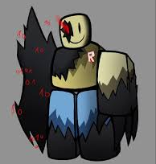

OrganizaciГіn de archivos:
```
sistema-general
в”њв”Ђв”Ђ config
в”‚   в””в”Ђв”Ђ db.php
в”њв”Ђв”Ђ includes
в”‚   в”њв”Ђв”Ђ functions.php
в”‚   в”њв”Ђв”Ђ layout.php
в”‚   в”њв”Ђв”Ђ procesar_login.php
в”‚   в”њв”Ђв”Ђ procesar_perfil.php
в”‚   в””в”Ђв”Ђ procesar_registro.php
в”њв”Ђв”Ђ public
в”‚   в”њв”Ђв”Ђ audio
в”‚   в”‚   в””в”Ђв”Ђ grito.mp3
в”‚   в”њв”Ђв”Ђ css
в”‚   в”‚   в”њв”Ђв”Ђ ajustes.css
в”‚   в”‚   в”њв”Ђв”Ђ style.css
в”‚   в”‚   в””в”Ђв”Ђ try.css
в”‚   в”њв”Ђв”Ђ images
в”‚   в”‚   в”њв”Ђв”Ђ mirk.png
в”‚   в”‚   в”њв”Ђв”Ђ mon.png
в”‚   в”‚   в”њв”Ђв”Ђ placeholder.png
в”‚   в”‚   в””в”Ђв”Ђ sistema de copyright.gif
в”‚   в””в”Ђв”Ђ js
в”‚       в””в”Ђв”Ђ main.js
в”њв”Ђв”Ђ sql
в”‚   в””в”Ђв”Ђ taf2.sql
в”њв”Ђв”Ђ views
в”‚   в”њв”Ђв”Ђ ajustes.php
в”‚   в”њв”Ђв”Ђ buscar.php
в”‚   в”њв”Ђв”Ђ home.php
в”‚   в”њв”Ђв”Ђ login.php
в”‚   в”њв”Ђв”Ђ perfil.php
в”‚   в”њв”Ђв”Ђ register.php
в”‚   в””в”Ђв”Ђ siscop.php
в”њв”Ђв”Ђ index.php
в””в”Ђв”Ђ logout.php
```

db.php:
```
<?php
function conectarBD()
{
    $host = 'localhost';
    $dbname = 'taf2';
    $username = 'root';
    $password = '';
    $con = mysqli_connect($host, $username, $password, $dbname);
    if (!$con) {
        error_log('Error de conexiГіn a la base de datos: ' . mysqli_connect_error());
        die('Error de conexiГіn a la base de datos: ' . mysqli_connect_error());
    }
    mysqli_set_charset($con, 'utf8mb4');
    return $con;
}
```

functions.php:
```
<?php
function obtenerProductos($con, $busqueda = '')
{
    if ($busqueda) {
        $busqueda = "%$busqueda%";
        $stmt = mysqli_prepare($con, "SELECT id_pro, nom_pro, descripcion, precio FROM producto WHERE nom_pro LIKE ? OR descripcion LIKE ? LIMIT 20");
        mysqli_stmt_bind_param($stmt, 'ss', $busqueda, $busqueda);
        mysqli_stmt_execute($stmt);
        $result = mysqli_stmt_get_result($stmt);
        $productos = mysqli_fetch_all($result, MYSQLI_ASSOC);
        mysqli_stmt_close($stmt);
        return $productos;
    } else {
        $result = mysqli_query($con, "SELECT id_pro, nom_pro, descripcion, precio FROM producto LIMIT 20");
        return mysqli_fetch_all($result, MYSQLI_ASSOC);
    }
}

/**
 * Obtener descripciГіn de perfil de un usuario
 */
function obtenerDescripcionUsuario($con, $correo)
{
    $stmt = mysqli_prepare($con, 'SELECT descripcion FROM usuarios WHERE correo = ? LIMIT 1');
    mysqli_stmt_bind_param($stmt, 's', $correo);
    mysqli_stmt_execute($stmt);
    $result = mysqli_stmt_get_result($stmt);
    $descripcion = '';
    if ($result && mysqli_num_rows($result) === 1) {
        $row = mysqli_fetch_assoc($result);
        $descripcion = $row['descripcion'] ?? '';
    }
    mysqli_stmt_close($stmt);
    return $descripcion;
}

/**
 * Verificar si el usuario estГЎ logueado
 */
function estaLogueado()
{
    return isset($_SESSION['usuario']) && !empty($_SESSION['usuario']);
}

/**
 * Redirigir a una URL
 */
function redirigir($url)
{
    // Si ya es absoluta (empieza con /) o URL completa, usar tal cual
    if (strpos($url, '/') === 0 || preg_match('#^[a-zA-Z][a-zA-Z0-9+.-]*://#', $url)) {
        header("Location: $url");
        exit;
    }

    // Calcular la ruta URL base del proyecto una sola vez
    static $baseUrl = null;
    if ($baseUrl === null) {
        $projectRoot = dirname(__DIR__); // Sube desde includes/ a la raГ­z
        $docRoot = $_SERVER['DOCUMENT_ROOT'];
        $basePath = str_replace('\\', '/', substr($projectRoot, strlen($docRoot)));
        $baseUrl = rtrim($basePath, '/');
    }

    $url = $baseUrl . '/' . ltrim($url, '/');
    header("Location: $url");
    exit;
}

/**
 * Sanitizar HTML para mostrar
 */
function sanitizar($texto)
{
    return htmlspecialchars($texto, ENT_QUOTES, 'UTF-8');
}

/**
 * Validar email
 */
function esEmailValido($email)
{
    return filter_var($email, FILTER_VALIDATE_EMAIL) !== false;
}

/**
 * Generar respuesta JSON
 */
function respuestaJSON($exito, $mensaje, $datos = [])
{
    header('Content-Type: application/json');
    echo json_encode([
        'exito' => $exito,
        'mensaje' => $mensaje,
        'datos' => $datos
    ]);
    exit;
}
```

layout:
```
<!DOCTYPE html>
<html lang="es">

<head>
    <meta charset="UTF-8">
    <meta name="viewport" content="width=device-width, initial-scale=1.0">
    <script>
        (function(){
            try{
                var k = 'app_grayscale_mode';
                if (localStorage.getItem(k) === 'true') {
                    document.documentElement.classList.add('bw-mode');
                }
            } catch(e) { /* ignore */ }
        })();
    </script>
    <link rel="stylesheet" href="public/css/style.css">
    <link rel="icon" href="public/images/placeholder.png">
    <script src="https://cdn.jsdelivr.net/npm/sweetalert2@11"></script>

    <title><?= isset($titulo) ? htmlspecialchars($titulo) . ' - Tropical & Fresh' : 'Tropical & Fresh' ?></title>
</head>

<body>
<?php
    $descripcionPerfil = '';
    if (estaLogueado() && !empty($_SESSION['correo'])) {
        require_once __DIR__ . '/../config/db.php';
        $con = conectarBD();
        $descripcionPerfil = obtenerDescripcionUsuario($con, $_SESSION['correo']);
        mysqli_close($con);
        if (empty($descripcionPerfil) && !empty($_SESSION['descripcion'])) {
            $descripcionPerfil = $_SESSION['descripcion'];
        }
    }
    ?>

    <!-- Sidebar (solo para logueados) -->
    <?php if (estaLogueado()): ?>
        <div class="notification-widget" id="notificationWidget">
            <button id="notificationBell" class="notification-bell" aria-label="Abrir notificaciones">
                <span class="bell-icon">рџ””</span>
                <span id="notificationCount" class="notification-count">0</span>
            </button>
            <div id="notificationPanel" class="notification-panel hidden" aria-hidden="true">
                <div class="notification-panel-header">
                    <span>Notificaciones</span>
                    <button id="notificationClose" class="notification-close" aria-label="Cerrar">Г—</button>
                </div>
                <div class="notification-list" id="notificationList">
                    <div class="notification-item empty">No hay notificaciones nuevas.</div>
                </div>
            </div>
        </div>
        <div class="sidebar" id="sidebar">
            <a href="index.php" class="sidebar-back-button" title="Volver al inicio">в†ђ</a>
            <div class="profile-center">
                <?php if (!empty($_SESSION['imagen'])): ?>
                    " alt="Perfil">
                <?php else: ?>
                    
                <?php endif; ?>
            </div>
            <h1 style="text-align: center; margin-bottom: 10px;"><?= htmlspecialchars($_SESSION['usuario']) ?></h1>
            <h1 style="text-align: center; margin-top: 0; margin-bottom: 20px; font-size: 1.2rem; color: #7e7e7e;"> <?= htmlspecialchars($descripcionPerfil ?: 'Perfil sin descripciГіn') ?></h1>
            <nav class="sidebar-menu">
                <a href="index.php?page=perfil" class="menu-item">Perfil</a>
                <a href="index.php?page=pedidos" class="menu-item">Pedidos</a>
                <a href="index.php?page=recetas" class="menu-item">Recetas</a>
                <a href="index.php?page=ajustes" class="menu-item">Ajustes</a>
            </nav>
            <nav class="sidebar-menu-bottom">
                <a href="index.php?page=logout" class="menu-item logout">Cerrar sesiГіn</a>
            </nav>
        </div>
        <div id="hoverHolder" title="Abrir menГє"></div>
    <?php endif; ?>

    <!-- Contenido especГ­fico de cada pГЎgina -->
    <?= $contenido ?? '' ?>

    <!-- Footer -->
    <footer class="site-footer">
        <div class="footer-inner">
            <p><a href="views/siscop.php" class="footer-link">&copy;</a>Samuel Varela y Diego Garcia — Todos los derechos reservados.</p>
        </div>
    </footer>

    <script src="public/js/main.js"></script>
</body>
<script>
(function() {
    // Aplicar apariencia adicional
    const fontSize = localStorage.getItem('fontSize');
    if (fontSize === 'small') document.documentElement.classList.add('font-small');
    if (fontSize === 'large') document.documentElement.classList.add('font-large');
    if (localStorage.getItem('highContrast') === 'true') document.documentElement.classList.add('high-contrast');
    if (localStorage.getItem('noAnimations') === 'true') document.documentElement.classList.add('no-animations');
})();
</script>
</html>
```

procesar_login.php:
```
<?php
session_start();
require_once __DIR__ . '/../config/db.php';
require_once __DIR__ . '/functions.php';

$con = conectarBD();

if ($_SERVER['REQUEST_METHOD'] === 'POST' && isset($_POST['inic'])) {
    $email = trim($_POST['correo'] ?? '');
    $password = $_POST['contrasena'] ?? '';

    if (empty($email) || empty($password)) {
        redirigir('index.php?page=login&error=empty_fields');
    }

    $stmt = mysqli_prepare($con, 'SELECT nom_com, usu_con, imagen FROM usuarios WHERE correo = ? LIMIT 1');
    mysqli_stmt_bind_param($stmt, 's', $email);
    mysqli_stmt_execute($stmt);
    $result = mysqli_stmt_get_result($stmt);

    if ($result && mysqli_num_rows($result) === 1) {
        $user = mysqli_fetch_assoc($result);

        if (password_verify($password, $user['usu_con'])) {
            $_SESSION['usuario'] = $user['nom_com'];
            $_SESSION['correo'] = $email;
            $_SESSION['imagen'] = $user['imagen'];

            if (!empty($_POST['recordar'])) {
                setcookie('correo', $email, time() + 86400 * 30, '/');
            }

            redirigir('index.php');
        } else {
            redirigir('index.php?page=login&error=wrong_password');
        }
    } else {
        redirigir('index.php?page=login&error=user_not_found');
    }

    mysqli_stmt_close($stmt);
} else {
    redirigir('index.php?page=login');
}

mysqli_close($con);
```

procesar_perfil.php:
```
<?php
session_start();
require_once __DIR__ . '/../config/db.php';
require_once __DIR__ . '/functions.php';

header('Content-Type: application/json');

if (!estaLogueado()) {
    respuestaJSON(false, 'No estГЎs logueado');
}

$con = conectarBD();
$userEmail = $_SESSION['correo'];
$accion = $_GET['accion'] ?? $_POST['accion'] ?? '';

function columnaExiste($con, $columna)
{
    $columna = mysqli_real_escape_string($con, $columna);
    $resultado = mysqli_query($con, "SHOW COLUMNS FROM usuarios LIKE '" . $columna . "'");
    return $resultado && mysqli_num_rows($resultado) > 0;
}

// Actualizar perfil
if ($accion === 'actualizar' && $_SERVER['REQUEST_METHOD'] === 'POST') {
    $nombre = trim($_POST['nombre'] ?? '');
    $telefono = trim($_POST['telefono'] ?? '');
    $direccion = trim($_POST['direccion'] ?? '');
    $alergias = trim($_POST['alergias'] ?? '');
    $descripcion = trim($_POST['descripcion'] ?? '');

    if (empty($nombre)) {
        respuestaJSON(false, 'El nombre es obligatorio');
    }

    $imagen = null;
    if (!empty($_FILES['imagen']['tmp_name']) && $_FILES['imagen']['error'] == 0) {
        $check = getimagesize($_FILES['imagen']['tmp_name']);
        if ($check !== false) {
            $imagen = file_get_contents($_FILES['imagen']['tmp_name']);
        } else {
            respuestaJSON(false, 'El archivo no es una imagen vГЎlida');
        }
    }

    $campos = [
        'nom_com' => $nombre,
        'telefono' => $telefono,
    ];

    if (columnaExiste($con, 'direccion')) {
        $campos['direccion'] = $direccion;
    }
    if (columnaExiste($con, 'alergias')) {
        $campos['alergias'] = $alergias;
    }
    if (columnaExiste($con, 'descripcion')) {
        $campos['descripcion'] = $descripcion;
    }
    if ($imagen !== null && columnaExiste($con, 'imagen')) {
        $campos['imagen'] = $imagen;
    }

    $set = [];
    $types = '';
    $values = [];
    foreach ($campos as $nombreCampo => $valorCampo) {
        $set[] = "$nombreCampo = ?";
        $types .= 's';
        $values[] = $valorCampo;
    }

    if (empty($set)) {
        respuestaJSON(false, 'No hay campos disponibles para actualizar');
    }

    $query = 'UPDATE usuarios SET ' . implode(', ', $set) . ' WHERE correo = ?';
    $types .= 's';
    $values[] = $userEmail;

    $stmt = mysqli_prepare($con, $query);
    mysqli_stmt_bind_param($stmt, $types, ...$values);

    if (mysqli_stmt_execute($stmt)) {
        $_SESSION['usuario'] = $nombre;
        if ($imagen !== null) {
            $_SESSION['imagen'] = $imagen;
        }
        if (!empty($descripcion)) {
            $_SESSION['descripcion'] = $descripcion;
        }
        mysqli_stmt_close($stmt);
        respuestaJSON(true, 'Perfil actualizado correctamente');
    }

    respuestaJSON(false, 'Error al actualizar el perfil');
}

// Eliminar perfil
if ($accion === 'eliminar' && $_SERVER['REQUEST_METHOD'] === 'POST') {
    $stmt = mysqli_prepare($con, 'DELETE FROM usuarios WHERE correo = ?');
    mysqli_stmt_bind_param($stmt, 's', $userEmail);

    if (mysqli_stmt_execute($stmt)) {
        session_destroy();
        mysqli_stmt_close($stmt);
        respuestaJSON(true, 'Perfil eliminado correctamente');
    }

    respuestaJSON(false, 'Error al eliminar el perfil');
}

if ($accion === 'actualizar_alergias' && $_SERVER['REQUEST_METHOD'] === 'POST') {
    $alergias = trim($_POST['alergias'] ?? '');
    $check = mysqli_query($con, "SHOW COLUMNS FROM usuarios LIKE 'alergias'");
    if (mysqli_num_rows($check) == 0) {
        mysqli_query($con, "ALTER TABLE usuarios ADD COLUMN alergias TEXT DEFAULT NULL");
    }
    $stmt = mysqli_prepare($con, 'UPDATE usuarios SET alergias = ? WHERE correo = ?');
    mysqli_stmt_bind_param($stmt, 'ss', $alergias, $userEmail);
    if (mysqli_stmt_execute($stmt)) {
        respuestaJSON(true, 'Alergias guardadas correctamente');
    } else {
        respuestaJSON(false, 'Error al guardar alergias');
    }
}

if ($accion === 'actualizar_notificaciones' && $_SERVER['REQUEST_METHOD'] === 'POST') {
    $notificaciones = (int)($_POST['notificaciones'] ?? 0);
    // Asegurarse de que la columna exista (si no, crear)
    $check = mysqli_query($con, "SHOW COLUMNS FROM usuarios LIKE 'notificaciones'");
    if (mysqli_num_rows($check) == 0) {
        mysqli_query($con, "ALTER TABLE usuarios ADD COLUMN notificaciones TINYINT(1) DEFAULT 0");
    }
    $stmt = mysqli_prepare($con, 'UPDATE usuarios SET notificaciones = ? WHERE correo = ?');
    mysqli_stmt_bind_param($stmt, 'is', $notificaciones, $userEmail);
    if (mysqli_stmt_execute($stmt)) {
        respuestaJSON(true, 'Preferencia de notificaciones actualizada');
    } else {
        respuestaJSON(false, 'Error al actualizar');
    }
}

respuestaJSON(false, 'AcciГіn no vГЎlida');
```

procesar_registro:
```
<?php
session_start();
require_once __DIR__ . '/../config/db.php';
require_once __DIR__ . '/functions.php';

$con = conectarBD();

if ($_SERVER['REQUEST_METHOD'] === 'POST' && isset($_POST['regi'])) {
    $nombre = trim($_POST['nombre'] ?? '');
    $email = trim($_POST['correo'] ?? '');
    $password = $_POST['contrasena'] ?? '';
    $descripcion = trim($_POST['descripcion'] ?? '');
    $imagen = null;

    // Validaciones bГЎsicas
    if (empty($nombre) || empty($email) || empty($password)) {
        redirigir('index.php?page=register&error=empty_fields');
    }

    if (!esEmailValido($email)) {
        redirigir('index.php?page=register&error=invalid_email');
    }

    if (strlen($password) < 6) {
        redirigir('index.php?page=register&error=weak_password');
    }

    // Verificar si el email ya existe
    $stmt = mysqli_prepare($con, 'SELECT id_usu FROM usuarios WHERE correo = ? LIMIT 1');
    mysqli_stmt_bind_param($stmt, 's', $email);
    mysqli_stmt_execute($stmt);
    $result = mysqli_stmt_get_result($stmt);

    if (mysqli_num_rows($result) > 0) {
        redirigir('index.php?page=register&error=email_exists');
    }
    mysqli_stmt_close($stmt);

    // Procesar imagen si existe
    if (isset($_FILES['profile-pic']) && $_FILES['profile-pic']['error'] !== UPLOAD_ERR_NO_FILE) {
        if ($_FILES['profile-pic']['error'] !== UPLOAD_ERR_OK) {
            redirigir('index.php?page=register&error=upload_failed');
        }

        $check = getimagesize($_FILES['profile-pic']['tmp_name']);
        if ($check === false) {
            redirigir('index.php?page=register&error=invalid_image');
        }

        $imagen = file_get_contents($_FILES['profile-pic']['tmp_name']);
    }

    // Establecer descripciГіn por defecto si estГЎ vacГ­a
    if (empty($descripcion)) {
        $descripcion = 'perfil sin descripcion';
    }

    // Hashear contraseГ±a
    $passwordHash = password_hash($password, PASSWORD_DEFAULT);

    if ($imagen !== null) {
        $stmt = mysqli_prepare($con, 'INSERT INTO usuarios (nom_com, correo, usu_con, descripcion, imagen) VALUES (?, ?, ?, ?, ?)');
        mysqli_stmt_bind_param($stmt, 'sssss', $nombre, $email, $passwordHash, $descripcion, $imagen);
    } else {
        $stmt = mysqli_prepare($con, 'INSERT INTO usuarios (nom_com, correo, usu_con, descripcion) VALUES (?, ?, ?, ?)');
        mysqli_stmt_bind_param($stmt, 'ssss', $nombre, $email, $passwordHash, $descripcion);
    }

    if ($stmt && mysqli_stmt_execute($stmt)) {
        $_SESSION['usuario'] = $nombre;
        $_SESSION['correo'] = $email;
        $_SESSION['descripcion'] = $descripcion;
        if ($imagen !== null) {
            $_SESSION['imagen'] = $imagen;
        }
        mysqli_stmt_close($stmt);
        redirigir('index.php');
    } else {
        redirigir('index.php?page=register&error=register_failed');
    }

    mysqli_stmt_close($stmt);
} else {
    redirigir('index.php?page=register');
}

mysqli_close($con);
```

ajustes.css:
```
* {
            margin: 0;
            padding: 0;
            box-sizing: border-box;
        }

        body {
            font-family: system-ui, 'Segoe UI', 'Roboto', 'Helvetica Neue', sans-serif;
            background: #f4f7fc;
            color: #1a2c3e;
            line-height: 1.5;
            transition: filter 0.25s ease;
        }

        /* modo oscuro (tema negro) se aplica directamente al body */
        body.bw-mode {
            background: #0b1220;
            color: #cbd5e1;
        }

        /* Tonos de tarjetas y elementos para modo oscuro */
        body.bw-mode .settings-card,
        body.bw-mode .demo-card,
        body.bw-mode .gradient-box,
        body.bw-mode .inline-colorful>span,
        body.bw-mode .button-group .btn {
            background-color: #0f1724;
            color: #cbd5e1;
            border-color: rgba(255, 255, 255, 0.03);
            box-shadow: none;
        }

        body.bw-mode .status-badge {
            background: #111827;
            color: #cbd5e1;
        }

        /* Forzar tonos neutros en barras y chips que usan estilos inline */
        body.bw-mode .card-color-bar {
            background: linear-gradient(90deg, #111827, #374151) !important;
        }

        body.bw-mode .color-chip {
            background: #374151 !important;
            border-color: rgba(255, 255, 255, 0.03) !important;
        }

        body.bw-mode .btn {
            background-color: #1f2937 !important;
            color: #e6eef8 !important;
            box-shadow: none;
        }

        body.bw-mode .btn-primary {
            background: #2563eb !important;
            color: white !important;
        }

        body.bw-mode .btn-success {
            background: #15803d !important;
        }

        body.bw-mode .btn-warning {
            background: #b45309 !important;
        }

        body.bw-mode .btn-outline {
            background: transparent;
            border-color: rgba(255, 255, 255, 0.06);
            color: #cbd5e1;
        }

        body.bw-mode .badge,
        body.bw-mode .badge-blue,
        body.bw-mode .badge-pink {
            background: #374151 !important;
            color: #e6eef8 !important;
        }

        body.bw-mode hr {
            background: linear-gradient(to right, rgba(255, 255, 255, 0.03), transparent);
        }

        body.bw-mode .page-header h1 {
            background: none;
            color: #e6eef8;
            -webkit-background-clip: unset;
        }

        /* Contenedor principal estilo dashboard */
        .settings-container {
            max-width: 1100px;
            margin: 2rem auto;
            padding: 1.5rem;
        }

        /* Header */
        .page-header {
            margin-bottom: 2rem;
            text-align: center;
        }

        .page-header h1 {
            font-size: 2rem;
            font-weight: 700;
            background: linear-gradient(135deg, #1e3c5c, #2b5b8b);
            background-clip: text;
            -webkit-background-clip: text;
            color: transparent;
            letter-spacing: -0.3px;
        }

        .page-header p {
            color: #4a627a;
            margin-top: 0.5rem;
            font-weight: 500;
        }

        /* Tarjeta de ajustes principal */
        .settings-card {
            background: rgba(255, 255, 255, 0.95);
            backdrop-filter: blur(0px);
            border-radius: 2rem;
            box-shadow: 0 20px 35px -12px rgba(0, 0, 0, 0.1), 0 1px 2px rgba(0, 0, 0, 0.02);
            padding: 1.8rem 2rem;
            margin-bottom: 2.5rem;
            border: 1px solid rgba(255, 255, 255, 0.5);
            transition: all 0.2s;
        }

        .setting-item {
            display: flex;
            flex-wrap: wrap;
            align-items: center;
            justify-content: space-between;
            gap: 1rem;
        }

        .setting-info {
            display: flex;
            flex-direction: column;
            gap: 0.3rem;
        }

        .setting-info h2 {
            font-size: 1.5rem;
            font-weight: 600;
            display: flex;
            align-items: center;
            gap: 0.6rem;
        }

        .setting-info h2 span {
            font-size: 1.6rem;
        }

        .setting-info .desc {
            color: #5c6f87;
            font-size: 0.9rem;
            max-width: 28rem;
        }

        /* Toggle Switch personalizado (moderno) */
        .toggle-switch {
            position: relative;
            display: inline-block;
            width: 68px;
            height: 34px;
            flex-shrink: 0;
        }

        .toggle-switch input {
            opacity: 0;
            width: 0;
            height: 0;
        }

        .slider {
            position: absolute;
            cursor: pointer;
            top: 0;
            left: 0;
            right: 0;
            bottom: 0;
            background-color: #cbd5e1;
            transition: 0.25s ease;
            border-radius: 34px;
            box-shadow: inset 0 1px 2px rgba(0, 0, 0, 0.05);
        }

        .slider:before {
            position: absolute;
            content: "";
            height: 26px;
            width: 26px;
            left: 4px;
            bottom: 4px;
            background-color: white;
            transition: 0.25s;
            border-radius: 50%;
            box-shadow: 0 1px 3px rgba(0, 0, 0, 0.2);
        }

        input:checked+.slider {
            background-color: #2c6e9e;
        }

        input:checked+.slider:before {
            transform: translateX(34px);
        }

        /* estado hover para feedback */
        .slider:hover {
            background-color: #b9c2d0;
        }

        input:checked+.slider:hover {
            background-color: #1f5880;
        }

        .status-badge {
            background: #eef2f8;
            border-radius: 100px;
            padding: 0.3rem 1rem;
            font-size: 0.85rem;
            font-weight: 500;
            color: #1f4e6e;
            margin-left: 0.75rem;
            white-space: nowrap;
        }

        /* zona de preview: muestras con colores vivos */
        .preview-area {
            margin-top: 1rem;
        }

        .preview-title {
            display: flex;
            align-items: baseline;
            justify-content: space-between;
            flex-wrap: wrap;
            margin-bottom: 1.25rem;
            border-left: 5px solid #3b82f6;
            padding-left: 1rem;
        }

        .preview-title h3 {
            font-size: 1.4rem;
            font-weight: 600;
            color: #0b3550;
        }

        .preview-title small {
            font-size: 0.8rem;
            color: #5d6f88;
            background: #e9edf2;
            padding: 0.2rem 0.7rem;
            border-radius: 30px;
        }

        .color-grid {
            display: grid;
            grid-template-columns: repeat(auto-fit, minmax(240px, 1fr));
            gap: 1.5rem;
            margin-bottom: 2rem;
        }

        /* tarjetas de demostraciГіn multicolor */
        .demo-card {
            background: white;
            border-radius: 1.5rem;
            overflow: hidden;
            box-shadow: 0 10px 20px -8px rgba(0, 0, 0, 0.1);
            transition: transform 0.15s ease, box-shadow 0.2s;
        }

        .demo-card:hover {
            transform: translateY(-4px);
            box-shadow: 0 20px 25px -12px rgba(0, 0, 0, 0.15);
        }

        .card-color-bar {
            height: 12px;
            width: 100%;
        }

        .card-content {
            padding: 1.3rem 1.2rem 1.5rem;
        }

        .card-content h4 {
            font-size: 1.25rem;
            font-weight: 600;
            margin-bottom: 0.5rem;
        }

        .card-content p {
            font-size: 0.85rem;
            color: #4b5563;
            margin-bottom: 1rem;
        }

        .chip-colors {
            display: flex;
            gap: 0.5rem;
            flex-wrap: wrap;
            margin: 0.5rem 0;
        }

        .color-chip {
            width: 32px;
            height: 32px;
            border-radius: 50%;
            border: 2px solid rgba(255, 255, 255, 0.6);
            box-shadow: 0 1px 3px rgba(0, 0, 0, 0.1);
        }

        /* botones y elementos adicionales coloridos */
        .button-group {
            display: flex;
            flex-wrap: wrap;
            gap: 1rem;
            margin: 1rem 0 1.5rem;
        }

        .btn {
            padding: 0.65rem 1.3rem;
            border-radius: 60px;
            border: none;
            font-weight: 600;
            font-size: 0.9rem;
            cursor: pointer;
            transition: 0.1s linear;
            background-color: #eef2ff;
            color: #1f3a5f;
            box-shadow: 0 1px 2px rgba(0, 0, 0, 0.05);
        }

        .btn-primary {
            background: #2266b9;
            color: white;
        }

        .btn-success {
            background: #2b7d4c;
            color: white;
        }

        .btn-warning {
            background: #e68a2e;
            color: white;
        }

        .btn-outline {
            background: transparent;
            border: 1.5px solid #4f7ea0;
            color: #1e5a7d;
        }

        .gradient-box {
            background: linear-gradient(135deg, #f093fb 0%, #f5576c 100%);
            border-radius: 1rem;
            padding: 1rem;
            text-align: center;
            color: white;
            font-weight: bold;
            margin-top: 0.8rem;
        }

        .inline-colorful {
            display: flex;
            gap: 0.75rem;
            align-items: center;
            flex-wrap: wrap;
            margin-top: 1rem;
            margin-bottom: 1rem;
        }

        .badge {
            background: #ffd966;
            padding: 0.25rem 1rem;
            border-radius: 40px;
            font-weight: 600;
            color: #5e3a00;
        }

        .badge-blue {
            background: #1e88e5;
            color: white;
        }

        .badge-pink {
            background: #ec489a;
            color: white;
        }

        hr {
            margin: 1.8rem 0;
            border: 0;
            height: 1px;
            background: linear-gradient(to right, #cfdfed, transparent);
        }

        footer {
            text-align: center;
            font-size: 0.8rem;
            color: #6c7e96;
            margin-top: 2rem;
            padding-top: 1rem;
            border-top: 1px solid #dfe6ef;
        }

        @media (max-width: 640px) {
            .settings-container {
                padding: 1rem;
            }

            .settings-card {
                padding: 1.3rem;
            }

            .setting-item {
                flex-direction: column;
                align-items: flex-start;
            }

            .status-badge {
                margin-left: 0;
                margin-top: 8px;
                display: inline-block;
            }

            .preview-title h3 {
                font-size: 1.2rem;
            }
        }
```

style:
```
/* =========================================
    VARIABLES Y RESET
========================================= */
:root {
    --glass-bg: #ffffff;
    --input-bg: #f4f8fb;
    --accent-1: #ff7a18;
    --accent-2: #af002d;
    --text: #1b3b4a;
}

/* =========================================
    DARK MODE GLOBAL (class: bw-mode)
    Paleta pensada para confort visual: negros profundos, grises suaves y textos claros.
    El fondo original se mantiene para que no cambie en modo oscuro.
========================================= */
.bw-mode, html.bw-mode body {
    color: #cbd5e1 !important;
    background-size: cover !important;
}

.bw-mode .contenido-principal,
.bw-mode .columna-de-acciГіn,
.bw-mode .card,
.bw-mode .spc,
.bw-mode .settings-card {
    background: #0f1724 !important;
    color: #cbd5e1 !important;
    box-shadow: none !important;
    border: 1px solid rgba(255,255,255,0.04) !important;
}

.bw-mode .sidebar {
    background: linear-gradient(180deg,#071428,#0b1220) !important;
    box-shadow: 0 12px 40px rgba(2,6,23,0.6) !important;
}
.bw-mode .sidebar .profile-center { background: #0b1220 !important; border-color: rgba(255,255,255,0.03) !important; }
.bw-mode .sidebar .menu-item {
    color: #dbe7f5 !important;
    background: transparent !important;
    border: 1px solid rgba(255,255,255,0.03) !important;
}
.bw-mode .sidebar .menu-item:hover {
    background: rgba(255,255,255,0.02) !important;
    transform: translateX(6px);
}

.bw-mode .logo-circle { border-color: rgba(255,255,255,0.03); box-shadow:none; }

.bw-mode .card > .info h3,
.bw-mode .marca h2,
.bw-mode .spc,
.bw-mode .card > .info p {
    color: #dbe7f5 !important;
}

.bw-mode .input-pastel {
    background: #0b1220 !important;
    color: #cbd5e1 !important;
    border: 1px solid rgba(255,255,255,0.04) !important;
}
.bw-mode .submit-btn {
    background: linear-gradient(90deg,#164e9b,#1f63a8) !important;
    box-shadow: 0 6px 18px rgba(2,6,23,0.6) !important;
}

.bw-mode .delet-buttons { box-shadow: 0 6px 18px rgba(2,6,23,0.6); }

/* Neutralizar colores fuertes de badges/botones cuando sea necesario */
.bw-mode .tag,
.bw-mode .card-color-bar,
.bw-mode .badge,
.bw-mode .badge-blue,
.bw-mode .badge-pink,
.bw-mode .color-chip {
    background: #1f2937 !important;
    color: #e6eef8 !important;
    border-color: rgba(255,255,255,0.03) !important;
}

.bw-mode hr { background: linear-gradient(to right, rgba(255,255,255,0.03), transparent) !important; }

body {
    font-family: Arial, sans-serif;
    animation: gradientMove 16s ease infinite;
    margin: 0;
    padding: 0;
    overflow-x: hidden;
    background: url('../images/cats.avif') no-repeat center center fixed;
    background-size: cover;
}

@keyframes gradientMove {
    0% {
        background-position: 0% 50%;
    }
    50% {
        background-position: 100% 50%;
    }
    100% {
        background-position: 0% 50%;
    }
}

/* =========================================
    LAYOUT GENERAL
========================================= */

.contenido-principal {
    width: 100%;
    max-width: 950px;
    margin: 0 auto;
}

.columna-de-acciГіn {
    box-shadow: 0 4px 24px rgba(174, 231, 248, 0.18);
    background: rgba(255, 255, 255, 0.92);
    border-radius: 24px;
    padding: 50px 40px;
    display: flex;
    flex-direction: column;
    justify-content: center;
    margin-bottom: 50px;
}

/* =========================================
    LOGO Y MARCA
========================================= */
.marca {
    text-align: center;
}

.logo-circle {
    width: 120px;
    height: 120px;
    background: linear-gradient(135deg, #ffcfaf, #ffd7f6);
    border-radius: 50%;
    display: flex;
    align-items: center;
    justify-content: center;
    margin: 0 auto 20px;
    box-shadow: 0 10px 30px rgba(0, 0, 0, 0.1);
    border: 3px solid rgba(255, 255, 255, 0.5);
}

.logo-circle span {
    font-size: 48px;
    font-weight: 800;
    color: #b86b77;
}

.marca h2 {
    font-size: 42px;
    font-weight: 700;
    color: #5a3e5a;
    letter-spacing: -1px;
}
.marca p {
    font-size: 18px;
    color: #7a5a7a;
    margin-top: 10px;
}

/* =========================================
    SIDEBAR
========================================= */
.sidebar {
    position: fixed;
    left: 0;
    top: 0;
    bottom: 0;
    width: 260px;
    background: linear-gradient(180deg, #ffffff, #f7fbff);
    transform: translateX(-260px);
    transition: transform 0.28s ease;
    box-shadow: 0 12px 40px rgba(6, 22, 41, 0.12);
    z-index: 40;
    padding: 22px 14px;
    display: flex;
    flex-direction: column;
    align-items: center;
    gap: 12px;
}

.sidebar .profile-center {
    width: 96px;
    height: 96px;
    border-radius: 50%;
    overflow: hidden;
    display: flex;
    align-items: center;
    justify-content: center;
    border: 3px solid rgba(0, 0, 0, 0.06);
    box-shadow: 0 6px 18px rgba(0, 0, 0, 0.06);
    background: #fff;
}

.sidebar .profile-center img {
    width: 100%;
    height: 100%;
    object-fit: cover;
    display: block;
    border-radius: 50%;
}

.sidebar-menu {
    width: 100%;
    margin-top: 14px;
    display: flex;
    flex-direction: column;
    gap: 10px;
    padding: 0 6px;
}

.sidebar .menu-item {
    display: flex;
    align-items: center;
    gap: 10px;
    padding: 10px 12px;
    border-radius: 10px;
    color: #1b3b4a;
    text-decoration: none;
    background: rgba(10, 130, 200, 0.03);
    border: 1px solid rgba(10, 130, 200, 0.04);
    font-weight: 600;
    transition:
        background 0.15s ease,
        transform 0.12s ease,
        box-shadow 0.12s ease;
}

.sidebar .menu-item:hover {
    background: rgba(10, 130, 200, 0.08);
    transform: translateX(6px);
    box-shadow: 0 6px 18px rgba(6, 22, 41, 0.06);
}

#hoverHolder {
    position: fixed;
    left: 0;
    top: 80px;
    width: 28px;
    height: 120px;
    background: linear-gradient(
        90deg,
        rgba(255, 255, 255, 0.06),
        rgba(174, 231, 248, 0.04)
    );
    border-top-right-radius: 16px;
    border-bottom-right-radius: 16px;
    box-shadow: 2px 0 8px rgba(0, 0, 0, 0.06);
    display: flex;
    align-items: center;
    justify-content: center;
    cursor: pointer;
    z-index: 900;
    transition:
        width 0.2s ease,
        background 0.2s ease;
}

#hoverHolder:hover {
    width: 44px;
    background: linear-gradient(
        90deg,
        rgba(255, 255, 255, 0.14),
        rgba(174, 231, 248, 0.06)
    );
}

#hoverHolder::after {
    width: 8px;
    height: 32px;
    background: #f8aedf;
    border-radius: 4px;
}

/* =========================================
    TARJETAS DE PRODUCTOS
========================================= */
.cards-grid {
    display: flex;
    justify-content: center;
}

.card {
    background: rgba(255, 255, 255);
    border: 1px solid rgba(170, 220, 245, 0.35);
    border-radius: 14px;
    box-shadow: 0 12px 30px rgba(10, 130, 200, 0.06);
    padding: 14px;
    display: flex;
    gap: 14px;
    align-items: center;
    width: auto;
    max-width: 400px;
    margin: 10px;
    transition:
        transform 0.18s ease,
        box-shadow 0.18s ease;
}

.card:hover {
    transform: translateY(-8px);
    box-shadow: 0 20px 44px rgba(10, 130, 200, 0.12);
}

.card .thumb {
    width: 84px;
    height: 84px;
    border-radius: 12px;
    overflow: hidden;
    flex-shrink: 0;
}

.card > .thumb img {
    width: 100%;
    height: 100%;
}

.card > .info h3 {
    margin: 0;
    color: #1b3b4a;
    letter-spacing: 0.2px;
}

.card > .info p {
    margin: 6px 0 0;
    font-size: 0.92rem;
    color: #556b76;
    line-height: 1.28;
}

.card > .info .tag {
    display: inline-block;
    margin-top: 8px;
    padding: 4px 8px;
    background: rgba(240, 150, 210, 0.14);
    color: #d24a8b;
    border-radius: 999px;
    font-size: 0.78rem;
    font-weight: 600;
}

/* =========================================
    LOGIN / REGISTER CARDS (.spc)
========================================= */
.spc {
    width: 420px;
    max-width: 92%;
    background: var(--glass-bg);
    border-radius: 16px;
    padding: 30px 26px;
    box-shadow: 0 12px 30px rgba(0, 0, 0, 0.12);
    text-align: center;
    display: flex;
    flex-direction: column;
    gap: 12px;
    margin: 0 auto;
    color: var(--text);
}

.input-pastel {
    width: 100%;
    padding: 14px 18px;
    border: 2px solid #aee7f8;
    border-radius: 60px;
    background: #ffd1dc;
    color: #444;
    font-size: 15px;
    outline: none;
    margin-bottom: 15px;
    transition: all 0.3s ease;
    box-sizing: border-box;
}

.input-pastel:focus {
    border-color: #e0a6b9;
    box-shadow: 0 0 0 3px rgba(224, 166, 185, 0.2);
    background: white;
}

.secondary-row {
    display: flex;
    justify-content: space-between;
    align-items: center;
    margin: 15px 0 25px;
    font-size: 14px;
    flex-wrap: wrap;
    gap: 10px;
}

.remember-label {
    display: flex;
    align-items: center;
    gap: 8px;
    color: #5a3e5a;
    cursor: pointer;
}
.checkbox-recordar {
    width: 18px;
    height: 18px;
    accent-color: #df9cb2;
}
.link-reg {
    color: #b86b77;
    text-decoration: none;
    font-weight: 500;
}
.link-reg:hover {
    text-decoration: underline;
}

.submit-btn {
    width: 100%;
    padding: 14px;
    background: linear-gradient(90deg, #ecbfb1, #df9cb2);
    border: none;
    border-radius: 60px;
    color: white;
    font-size: 16px;
    font-weight: 600;
    cursor: pointer;
    transition: all 0.3s ease;
    box-shadow: 0 4px 12px rgba(0, 0, 0, 0.08);
}

.submit-btn:hover {
    transform: translateY(-2px);
    background: linear-gradient(90deg, #e0a6b9, #d48ba8);
}

.back-home {
    text-align: center;
    margin-top: 25px;
}
.back-home a {
    color: #7a5a7a;
    text-decoration: none;
    font-size: 14px;
}
.back-home a:hover {
    color: #b86b77;
}

/* =========================================
    BOTONES Y ACCIONES
========================================= */

.delet-buttons {
    width: 120px;
    height: 48px;
    border-radius: 20px;
    cursor: pointer;
    padding: 0 12px;
    font-weight: 600;
    background: linear-gradient(90deg, #661515, #b12d2d);
    color: white;
    border: none;
    box-shadow: 0 6px 18px rgba(240, 100, 140, 0.12);
    transition:
    transform 0.12s ease,
    box-shadow 0.12s ease;
}
.delet-buttons:hover {
    transform: translateY(-2px);
    box-shadow: 0 12px 28px rgba(240, 100, 140, 0.16);
    background: url('https://us-tuna-sounds-images.voicemod.net/fbe2c85e-6382-448c-8f10-4b9d83e2da19-1718609963845.png') no-repeat center center fixed;
    background-size: cover;
}

/* =========================================
    BUSCADOR (CORRECCIГ“N)
========================================= */
.search-wrapper {
    margin-bottom: 35px;
}

.search-wrapper input {
    width: 100%;
    padding: 16px 22px;
    border: 2px solid #aee7f8;
    border-radius: 20px;
    font-size: 16px;
    background: #ffd1dc;
    color: #444;
    outline: none;
    transition: all 0.3s ease;
    box-sizing: border-box;
}

.search-wrapper input:focus {
    border: 2.5px solid #e0a6b9;
    box-shadow: 0 0 8px #c0e3ee;
}

.search-wrapper button {
    width: 100%;
    margin-top: 15px;
    padding: 16px;
    background: linear-gradient(90deg, #ecbfb1, #df9cb2);
    border: none;
    border-radius: 25px;
    color: white;
    font-size: 16px;
    font-weight: 600;
    cursor: pointer;
    transition: all 0.3s ease;
    box-shadow: 0 4px 12px rgba(0, 0, 0, 0.08);
}

.search-wrapper button:hover {
    background: linear-gradient(90deg, #e0a6b9, #d48ba8);
    transform: translateY(-2px);
}

/* =========================================
    FOOTER
========================================= */

.site-footer {
    box-shadow: 0 -6px 18px rgba(0, 0, 0, 0.04);
    color: #333333;
    margin: 40px 0 0 0;
    padding: 12px 0;
    width: 100vw;
    position: relative;
    left: 50%;
    right: 50%;
    margin-left: -50vw;
    margin-right: -50vw;
    box-sizing: border-box;
    position: relative;
}

.footer-inner {
    width: 100%;
    max-width: 100%;
    margin: 0 auto;
    padding: 0 20px;
    text-align: center;
    box-sizing: border-box;
}

.footer-link {
    color: inherit;
    text-decoration: none;
    cursor: default;
    font-weight: 400;
}
.footer-link:hover,
.footer-link:focus {
    text-decoration: none;
    outline: none;
}

.notification-widget {
    position: fixed;
    top: 18px;
    right: 22px;
    z-index: 1200;
    display: flex;
    flex-direction: column;
    align-items: flex-end;
    gap: 10px;
}

.notification-bell {
    position: relative;
    width: 52px;
    height: 52px;
    border: none;
    border-radius: 50%;
    background: rgba(255, 255, 255, 0.95);
    color: #111827;
    font-size: 1.35rem;
    cursor: pointer;
    display: inline-flex;
    align-items: center;
    justify-content: center;
    box-shadow: 0 16px 36px rgba(15, 23, 42, 0.12);
    transition: transform 0.2s ease, background 0.2s ease;
}

.notification-bell:hover {
    transform: translateY(-1px);
    background: #ffffff;
}

.notification-count {
    position: absolute;
    top: 8px;
    right: 8px;
    min-width: 18px;
    padding: 0 6px;
    border-radius: 999px;
    background: #ef4444;
    color: white;
    font-size: 0.75rem;
    font-weight: 700;
    line-height: 1.2;
    display: inline-flex;
    align-items: center;
    justify-content: center;
}

.notification-panel {
    width: 320px;
    max-height: 380px;
    background: rgba(255, 255, 255, 0.98);
    border-radius: 20px;
    box-shadow: 0 22px 48px rgba(15, 23, 42, 0.18);
    overflow: hidden;
    backdrop-filter: blur(14px);
    border: 1px solid rgba(15, 23, 42, 0.08);
    opacity: 0;
    transform: translateY(-12px);
    transition: opacity 0.24s ease, transform 0.24s ease;
}

.notification-panel.visible {
    opacity: 1;
    transform: translateY(0);
}

.notification-panel-header {
    display: flex;
    align-items: center;
    justify-content: space-between;
    padding: 14px 16px;
    border-bottom: 1px solid rgba(15, 23, 42, 0.08);
    font-weight: 700;
    color: #111827;
}

.notification-close {
    border: none;
    background: transparent;
    color: #4b5563;
    font-size: 1.3rem;
    cursor: pointer;
    line-height: 1;
}

.notification-list {
    max-height: 292px;
    overflow-y: auto;
    padding: 12px 14px 16px;
    display: flex;
    flex-direction: column;
    gap: 10px;
}

.notification-item {
    padding: 12px 14px;
    border-radius: 16px;
    background: #f8fafc;
    color: #0f172a;
    box-shadow: inset 0 1px 2px rgba(15, 23, 42, 0.05);
    font-size: 0.95rem;
    line-height: 1.4;
}

.notification-item.empty {
    background: transparent;
    color: #475569;
    font-style: italic;
    box-shadow: none;
}

.notification-panel.hidden {
    display: none;
}

@media (max-width: 640px) {
    .notification-widget {
        right: 12px;
        top: 12px;
    }
    .notification-panel {
        width: calc(100vw - 28px);
    }
}

/* =========================================
    PERFIL Y OTROS
========================================= */
.perfil-header {
    display: flex;
    flex-wrap: wrap;
    gap: 24px;
    align-items: center;
    justify-content: center;
    margin-top: 20px;
}

.perfil-foto {
    width: 180px;
    height: 180px;
    border-radius: 50%;
    background-size: cover;
    background-position: center;
    box-shadow: 0 12px 30px rgba(0, 0, 0, 0.12);
}

.profile-info {
    flex: 1;
    min-width: 260px;
    max-width: 720px;
}
.profile-info h1 {
    margin-bottom: 8px;
}
.profile-item {
    margin: 8px 0;
    line-height: 1.6;
}
.profile-grid {
    display: grid;
    gap: 12px;
    margin-top: 22px;
}
.profile-summary {
    width: 100%;
    max-width: 800px;
    margin: 20px auto 0 auto;
    padding: 18px;
    border-radius: 14px;
    background: rgba(255, 255, 255, 0.9);
    box-shadow: 0 8px 18px rgba(0, 0, 0, 0.08);
}
.sidebar-back-button {
    position: absolute;
    z-index: 10;
    top: 12px;
    left: 12px;
    width: 34px;
    height: 34px;
    display: flex;
    align-items: center;
    justify-content: center;
    border-radius: 50%;
    background: rgba(255, 255, 255, 0.95);
    color: #333;
    text-decoration: none;
    font-size: 18px;
    box-shadow: 0 4px 12px rgba(0, 0, 0, 0.15);
    transition: transform 0.15s ease, background 0.15s ease;
}
.sidebar-back-button:hover {
    transform: scale(1.05);
    background: rgba(255, 255, 255, 1);
}
/* =========================================
    RESPONSIVE
========================================= */
/* @media (max-width: 900px) {
    .marca h2 {
        font-size: 32px;
    }
    .contenido-principal {
        gap: 30px;
    }
    .columna-de-acciГіn {
        padding: 35px 25px;
    }
    .botones-dobles {
        flex-direction: column;
    }
}

@media (max-width: 820px) {
    .cards-grid {
        grid-template-columns: 1fr;
        gap: 14px;
    }
    .perfil-header {
        flex-direction: column;
        text-align: center;
    }
    .profile-info {
        width: 100%;
    }
}

@media (max-width: 520px) {
    .corner-buttons {
        top: 10px;
        right: 10px;
        gap: 8px;
    }
    .corner-buttons .submit-btn {
        padding: 8px 10px;
        font-size: 0.9rem;
    }
} */
/* =========================================
   MODO OSCURO GLOBAL (clase .bw-mode)
   Fondo oscuro, texto claro, sin perder contraste
========================================= */

/* Fondo principal y colores base */
.bw-mode,
.bw-mode body {
    background: #0a0f1c !important;
    color: #e2e8f0 !important;
}

/* Todas las tarjetas, contenedores principales */
.bw-mode .contenido-principal,
.bw-mode .columna-de-acciГіn,
.bw-mode .card,
.bw-mode .spc,
.bw-mode .settings-card,
.bw-mode .search-hero,
.bw-mode .demo-card,
.bw-mode .profile-summary {
    background: #111827 !important;
    color: #e2e8f0 !important;
    border: 1px solid rgba(255,255,255,0.05) !important;
    box-shadow: 0 10px 25px -5px rgba(0,0,0,0.3) !important;
}

/* Sidebar */
.bw-mode .sidebar {
    background: #0b0f17 !important;
    border-right: 1px solid rgba(255,255,255,0.05) !important;
}
.bw-mode .sidebar .profile-center {
    background: #1f2937 !important;
    border-color: rgba(255,255,255,0.1) !important;
}
.bw-mode .sidebar .menu-item {
    color: #cbd5e1 !important;
    background: rgba(255,255,255,0.02) !important;
    border-color: rgba(255,255,255,0.03) !important;
}
.bw-mode .sidebar .menu-item:hover {
    background: rgba(255,255,255,0.08) !important;
    color: white !important;
}

/* Inputs, campos de texto, buscador */
.bw-mode .input-pastel,
.bw-mode .search-field input,
.bw-mode .search-wrapper input {
    background: #1e293b !important;
    border-color: #334155 !important;
    color: #f1f5f9 !important;
}
.bw-mode .input-pastel:focus,
.bw-mode .search-field input:focus {
    border-color: #3b82f6 !important;
    background: #0f172a !important;
}

/* Botones principales */
.bw-mode .submit-btn,
.bw-mode .search-wrapper button,
.bw-mode .btn-primary {
    background: #2563eb !important;
    color: white !important;
    box-shadow: 0 4px 12px rgba(0,0,0,0.3) !important;
}
.bw-mode .submit-btn:hover,
.bw-mode .search-wrapper button:hover {
    background: #1d4ed8 !important;
}

/* Botones secundarios y de eliminaciГіn */
.bw-mode .delet-buttons {
    background: #991b1b !important;
    color: white !important;
}
.bw-mode .btn-outline {
    background: transparent !important;
    border-color: #475569 !important;
    color: #cbd5e1 !important;
}

/* Enlaces */
.bw-mode a:not(.btn):not(.menu-item) {
    color: #60a5fa !important;
}
.bw-mode a:hover {
    color: #93c5fd !important;
}

/* Footer */
.bw-mode .site-footer {
    background: #0b0f17 !important;
    color: #9ca3af !important;
    border-top: 1px solid rgba(255,255,255,0.05) !important;
}

/* Tarjetas de productos (home y buscar) */
.bw-mode .card {
    background: #1e293b !important;
}
.bw-mode .card .info h3,
.bw-mode .card .info p {
    color: #e2e8f0 !important;
}
.bw-mode .tag {
    background: #334155 !important;
    color: #f1f5f9 !important;
}

/* Resultados de bГєsqueda */
.bw-mode .results-meta {
    border-bottom-color: #334155 !important;
}
.bw-mode .results-badge {
    background: #1e293b !important;
    color: #94a3b8 !important;
}
.bw-mode .empty-state {
    background: #1e293b !important;
    color: #cbd5e1 !important;
    border-color: #334155 !important;
}

/* Checkbox, radio, etc */
.bw-mode .checkbox-recordar {
    accent-color: #3b82f6;
}

/* Perfil */
.bw-mode .perfil-foto {
    border: 3px solid #334155 !important;
}
.bw-mode .profile-item strong {
    color: #94a3b8;
}
.bw-mode .profile-summary {
    background: #1e293b !important;
}

/* Scrollbar opcional (mejora visual) */
.bw-mode ::-webkit-scrollbar {
    background: #0f172a;
}
.bw-mode ::-webkit-scrollbar-thumb {
    background: #334155;
    border-radius: 8px;
}
/* ===== Apariencia adicional ===== */
/* TamaГ±os de fuente */
.font-small body, .font-small .card, .font-small .spc {
    font-size: 0.85rem;
}
.font-large body, .font-large .card, .font-large .spc {
    font-size: 1.1rem;
}

/* Alto contraste (fondo blanco, texto negro, bordes marcados) */
.high-contrast, .high-contrast body {
    background: white !important;
    color: black !important;
}
.high-contrast .card, .high-contrast .spc, .high-contrast .sidebar {
    background: white !important;
    border: 2px solid black !important;
    color: black !important;
}
.high-contrast a {
    color: #0000EE !important;
}
.high-contrast .submit-btn {
    background: black !important;
    color: white !important;
    border: 1px solid white;
}

/* Desactivar animaciones */
.no-animations *, .no-animations *::before, .no-animations *::after {
    animation: none !important;
    transition: none !important;
    transform: none !important;
}
```

try:
```
/* ===== ESTILOS BUSCADOR SISTEMA GENERAL ===== */
:root {
    --bg-page: #f4f8fb;
    --surface: rgba(255, 255, 255, 0.96);
    --surface-strong: #ffffff;
    --border: rgba(10, 130, 200, 0.14);
    --accent: #0a82c8;
    --accent-soft: #d9edff;
    --text-dark: #1b3b4a;
    --text-soft: #5d707f;
    --shadow-sm: 0 14px 30px rgba(19, 50, 77, 0.08);
    --shadow-md: 0 20px 40px rgba(19, 50, 77, 0.1);
    --shadow-hover: 0 24px 45px rgba(19, 50, 77, 0.14);
    --radius-card: 22px;
    --radius-input: 60px;
}

html {
    box-sizing: border-box;
}

*, *::before, *::after {
    box-sizing: inherit;
}

body {
    margin: 0;
    min-height: 100vh;
    font-family: Arial, sans-serif;
}

.content {
    max-width: 1180px;
    margin: 0 auto;
    padding: 2.5rem 1.5rem 3rem;
}

.search-page {
    width: 100%;
}

.search-hero {
    background: var(--surface);
    border-radius: 32px;
    padding: 2.5rem 2rem;
    margin-bottom: 2.5rem;
    box-shadow: var(--shadow-sm);
    border: 1px solid var(--border);
    display: flex;
    flex-direction: column;
    align-items: center;
    justify-content: center;
    text-align: center;
}

.hero-text {
    max-width: 720px;
    width: 100%;
    margin: 0 auto 1.5rem;
}

.hero-text span {
    display: inline-block;
    font-size: 0.8rem;
    text-transform: uppercase;
    letter-spacing: 1.5px;
    font-weight: 700;
    color: var(--accent);
    background: rgba(10, 130, 200, 0.1);
    padding: 0.35rem 0.9rem;
    border-radius: 999px;
    margin-bottom: 1rem;
}

.hero-text h1 {
    font-size: 2.4rem;
    font-weight: 800;
    margin: 0 0 1rem;
    color: var(--text-dark);
}

.hero-text p {
    font-size: 1rem;
    color: var(--text-soft);
    max-width: 640px;
    margin: 0 0 1.75rem;
}

.search-panel {
    width: 100%;
    max-width: 760px;
    margin: 0 auto;
}

.search-form {
    display: flex;
    flex-wrap: wrap;
    justify-content: center;
    align-items: center;
    gap: 0.85rem;
    background: var(--surface-strong);
    padding: 0.6rem;
    border-radius: var(--radius-input);
    border: 1px solid rgba(10, 130, 200, 0.1);
    box-shadow: 0 10px 25px rgba(19, 50, 77, 0.06);
}

.search-form:focus-within {
    box-shadow: 0 0 0 4px rgba(10, 130, 200, 0.12), 0 10px 25px rgba(19, 50, 77, 0.06);
}

.search-field {
    flex: 1;
    margin: 0;
}

.search-field input {
    width: 100%;
    padding: 1rem 1.4rem;
    font-size: 1rem;
    border: 1px solid rgba(10, 130, 200, 0.16);
    border-radius: 999px;
    background: var(--input-bg, #f4f8fb);
    outline: none;
    color: var(--text-dark);
    font-weight: 500;
}

.search-field input::placeholder {
    color: #8a9cb3;
    font-weight: 400;
}

.search-btn:hover {
    transform: translateY(-1px);
    box-shadow: 0 14px 24px rgba(10, 130, 200, 0.2);
}

.search-btn:active {
    transform: translateY(0);
}

.results-meta {
    display: flex;
    justify-content: space-between;
    align-items: flex-end;
    flex-wrap: wrap;
    gap: 0.75rem;
    margin: 1.4rem 0 1.5rem;
    padding-bottom: 0.75rem;
    border-bottom: 1px solid rgba(10, 130, 200, 0.12);
}

.results-title {
    font-size: 1.1rem;
    font-weight: 600;
    color: black;
}

.results-title strong {
    color: var(--accent);
    font-weight: 700;
}

.results-badge {
    background: var(--accent-soft);
    color: var(--accent);
    padding: 0.45rem 1rem;
    border-radius: 999px;
    font-size: 0.85rem;
    font-weight: 700;
    letter-spacing: 0.2px;
}

.cards-grid {
    display: grid;
    grid-template-columns: repeat(auto-fill, minmax(280px, 1fr));
    gap: 1.75rem;
    margin-top: 1rem;
}

.card {
    background: var(--surface-strong);
    border: 1px solid rgba(10, 130, 200, 0.1);
    border-radius: 24px;
    overflow: hidden;
    transition: transform 0.25s ease, box-shadow 0.25s ease;
    box-shadow: 0 12px 28px rgba(19, 50, 77, 0.06);
}

.card:hover {
    transform: translateY(-4px);
    box-shadow: var(--shadow-hover);
}

.thumb {
    width: 100%;
    height: 200px;
    background: #eaf4ff;
    display: flex;
    align-items: center;
    justify-content: center;
    overflow: hidden;
}

.thumb img {
    width: 100%;
    height: 100%;
    object-fit: cover;
    transition: transform 0.4s ease;
}

.card:hover .thumb img {
    transform: scale(1.04);
}

.info {
    padding: 1.5rem 1.4rem 1.6rem;
}

.info h3 {
    font-size: 1.25rem;
    font-weight: 700;
    margin: 0 0 0.55rem;
    color: var(--text-dark);
}

.info p {
    font-size: 0.95rem;
    line-height: 1.6;
    color: var(--text-soft);
    margin-bottom: 1.4rem;
    display: -webkit-box;
    -webkit-line-clamp: 2;
    -webkit-box-orient: vertical;
    overflow: hidden;
}

.tag {
    display: inline-flex;
    align-items: center;
    justify-content: center;
    background: rgba(10, 130, 200, 0.1);
    color: var(--accent);
    font-weight: 700;
    padding: 0.45rem 1rem;
    border-radius: 999px;
    font-size: 0.95rem;
    border: 1px solid rgba(10, 130, 200, 0.14);
}

.empty-state {
    background: rgba(255, 255, 255, 0.9);
    border-radius: 24px;
    padding: 2.5rem 2rem;
    text-align: center;
    color: var(--text-soft);
    font-size: 1rem;
    border: 1px dashed rgba(10, 130, 200, 0.28);
    margin-top: 2rem;
}

.empty-state::before {
    content: "рџ”Ћ";
    font-size: 2.2rem;
    display: block;
    margin-bottom: 1rem;
    opacity: 0.75;
}

@media (max-width: 768px) {
    .content {
        padding: 1.5rem 1rem 2rem;
    }

    .search-hero {
        padding: 1.75rem 1.2rem;
    }

    .hero-text h1 {
        font-size: 1.85rem;
    }

    .hero-text p {
        font-size: 0.98rem;
    }

    .search-form {
        flex-direction: column;
        gap: 0.9rem;
        padding: 0;
        background: transparent;
        border: none;
        box-shadow: none;
    }

    .search-field input {
        background: var(--surface-strong);
        border: 1px solid rgba(10, 130, 200, 0.12);
    }

    .search-btn {
        width: 100%;
        padding: 0.95rem 1rem;
    }

    .cards-grid {
        grid-template-columns: 1fr;
        gap: 1.4rem;
    }

    .thumb {
        height: 180px;
    }

    .results-meta {
        flex-direction: column;
        align-items: stretch;
    }
}

@media (min-width: 1024px) {
    .cards-grid {
        grid-template-columns: repeat(3, minmax(260px, 1fr));
    }
}
/* ===== Modo oscuro para la pГЎgina de bГєsqueda ===== */
.bw-mode .search-hero {
    background: #111827 !important;
    border-color: #1f2937 !important;
}
.bw-mode .search-field input {
    background: #1e293b !important;
    color: #e2e8f0 !important;
    border-color: #334155 !important;
}
.bw-mode .search-btn {
    background: #2563eb !important;
}
.bw-mode .card {
    background: #1e293b !important;
    border-color: #2d3a4f !important;
}
.bw-mode .tag {
    background: #334155 !important;
    color: #f1f5f9 !important;
}
.bw-mode .empty-state {
    background: #111827 !important;
    color: #cbd5e1 !important;
}
```

main.js:
```
const sidebar = document.getElementById("sidebar");
const holder = document.getElementById("hoverHolder");
let closeTimeout = null;

function openSidebar() {
    clearTimeout(closeTimeout);
    if (sidebar) sidebar.style.transform = "translateX(0)";
}

function closeSidebar() {
    if (sidebar) sidebar.style.transform = "translateX(-260px)";
}

if (holder && sidebar) {
    holder.addEventListener("mouseenter", openSidebar);
    holder.addEventListener("mouseleave", () => {
        closeTimeout = setTimeout(closeSidebar, 350);
    });
    sidebar.addEventListener("mouseenter", () => clearTimeout(closeTimeout));
    sidebar.addEventListener("mouseleave", () => {
        closeTimeout = setTimeout(closeSidebar, 350);
    });
    closeSidebar();
}

const notificationBell = document.getElementById('notificationBell');
const notificationPanel = document.getElementById('notificationPanel');
const notificationClose = document.getElementById('notificationClose');
const notificationWidget = document.getElementById('notificationWidget');
const notificationCount = document.getElementById('notificationCount');
const notificationList = document.getElementById('notificationList');

function setNotificationPanelVisible(visible) {
    if (!notificationPanel) return;
    notificationPanel.classList.toggle('visible', visible);
    notificationPanel.classList.toggle('hidden', !visible);
    notificationPanel.setAttribute('aria-hidden', visible ? 'false' : 'true');
}

function updateNotifications() {
    if (!notificationCount || !notificationList) return;
    const stored = localStorage.getItem('systemNotifications');
    let items = [];
    try {
        items = stored ? JSON.parse(stored) : [];
    } catch (e) {
        items = [];
    }
    if (!Array.isArray(items)) items = [];
    notificationList.innerHTML = '';
    if (items.length === 0) {
        const empty = document.createElement('div');
        empty.className = 'notification-item empty';
        empty.textContent = 'No hay notificaciones nuevas.';
        notificationList.appendChild(empty);
    } else {
        items.forEach((item) => {
            const div = document.createElement('div');
            div.className = 'notification-item';
            div.textContent = item;
            notificationList.appendChild(div);
        });
    }
    notificationCount.textContent = String(items.length);
    notificationCount.style.display = items.length > 0 ? 'inline-flex' : 'none';
}

function toggleNotificationPanel() {
    if (!notificationPanel) return;
    setNotificationPanelVisible(!notificationPanel.classList.contains('visible'));
}

if (notificationBell) {
    notificationBell.addEventListener('click', (event) => {
        event.stopPropagation();
        toggleNotificationPanel();
    });
}
if (notificationClose) {
    notificationClose.addEventListener('click', () => {
        setNotificationPanelVisible(false);
    });
}

window.addEventListener('click', (event) => {
    if (!notificationWidget || !notificationPanel || !notificationPanel.classList.contains('visible')) return;
    if (!notificationWidget.contains(event.target)) {
        setNotificationPanelVisible(false);
    }
});

window.addEventListener('keydown', (event) => {
    if (event.key === 'Escape') {
        setNotificationPanelVisible(false);
    }
});

updateNotifications();

document.documentElement.style.zoom = "100%";
```

taf2.sql:
```
CREATE DATABASE IF NOT EXISTS `taf2`;
USE `taf2`;

-- 1. TABLAS INDEPENDIENTES
CREATE TABLE `roles` (
  `id_rol` int NOT NULL AUTO_INCREMENT,
  `nombre_rol` enum('admin','gerente','cajero','trabajador','cliente') NOT NULL,
  PRIMARY KEY (`id_rol`)
);

INSERT INTO `roles` (`nombre_rol`) VALUES
('admin'), ('gerente'), ('cajero'), ('trabajador'), ('cliente');

CREATE TABLE `categorias` (
  `id_cat` int NOT NULL AUTO_INCREMENT,
  `nombre_cat` varchar(50) NOT NULL,
  PRIMARY KEY (`id_cat`)
);

INSERT INTO `categorias` (`nombre_cat`) VALUES
('Bebidas'), ('Platos'), ('Postres'), ('Insumos'), ('Empaques');

CREATE TABLE `unidades_medida` (
  `id_uni` int NOT NULL AUTO_INCREMENT,
  `nombre_uni` varchar(20) NOT NULL,
  PRIMARY KEY (`id_uni`)
);

INSERT INTO `unidades_medida` (`nombre_uni`) VALUES
('ml'), ('gramos'), ('unidades'), ('porciones');

-- 2. PRODUCTOS E INSUMOS (Unificado para recetas e inventario)
CREATE TABLE `producto` (
  `id_pro` int NOT NULL AUTO_INCREMENT,
  `nom_pro` varchar(100) NOT NULL,
  `descripcion` varchar(255) DEFAULT NULL,
  `precio` decimal(10,2) NOT NULL DEFAULT 0.00,
  `id_cat` int NOT NULL,
  `tipo` enum('insumo','producto_final') NOT NULL DEFAULT 'producto_final',
  PRIMARY KEY (`id_pro`),
  FOREIGN KEY (`id_cat`) REFERENCES `categorias`(`id_cat`)
);

INSERT INTO `producto` (`nom_pro`, `descripcion`, `precio`, `id_cat`, `tipo`) VALUES
('Jugo de Naranja 500ml', '100% natural sin azГєcar', 6000.00, 1, 'producto_final'),
('Ensalada de Frutas Especial', 'Con helado y queso', 12500.00, 2, 'producto_final'),
('Naranja', 'Fruta fresca para jugos', 0.00, 4, 'insumo'),
('Vaso 500ml', 'Vaso desechable', 0.00, 5, 'insumo');

-- 3. USUARIOS
CREATE TABLE `usuarios` (
  `id_usu` int NOT NULL AUTO_INCREMENT,
  `id_rol` int NOT NULL DEFAULT 5, -- 5 = cliente por defecto
  `nom_com` varchar(100) NOT NULL,
  `usu_con` varchar(255) NOT NULL, -- Aumentado para password_hash()
  `correo` varchar(100) NOT NULL,
  `telefono` varchar(15) DEFAULT NULL,
  `direccion` varchar(255) DEFAULT NULL,
  `descripcion` varchar(255) DEFAULT NULL,
  `activo` tinyint(1) NOT NULL DEFAULT 1,
  PRIMARY KEY (`id_usu`),
  UNIQUE KEY `uq_correo` (`correo`),
  FOREIGN KEY (`id_rol`) REFERENCES `roles`(`id_rol`)
);

-- 4. INVENTARIO (Con alertas de stock mГ­nimo)
CREATE TABLE `inventario` (
  `id_inv` int NOT NULL AUTO_INCREMENT,
  `id_pro` int NOT NULL,
  `cantidad_disponible` decimal(10,2) NOT NULL DEFAULT 0.00,
  `id_uni` int NOT NULL,
  `stock_minimo` decimal(10,2) NOT NULL DEFAULT 0.00,
  `ubicacion_bodega` varchar(100) DEFAULT NULL,
  PRIMARY KEY (`id_inv`),
  FOREIGN KEY (`id_pro`) REFERENCES `producto`(`id_pro`),
  FOREIGN KEY (`id_uni`) REFERENCES `unidades_medida`(`id_uni`)
);

INSERT INTO `inventario` (`id_pro`, `cantidad_disponible`, `id_uni`, `stock_minimo`) VALUES
(3, 50.00, 2, 10.00), -- 50 Naranjas, mГ­nimo 10
(4, 100.00, 3, 20.00); -- 100 Vasos, mГ­nimo 20

-- 5. RECETAS Y PRODUCCIГ“N
CREATE TABLE `receta` (
  `id_rec` int NOT NULL AUTO_INCREMENT,
  `nombre` varchar(100) NOT NULL,
  `descripcion` text,
  `porcion_base` varchar(50) DEFAULT NULL,
  `tiempo_preparacion` int DEFAULT NULL COMMENT 'En minutos',
  `id_usu_creador` int NOT NULL,
  `es_estandar` tinyint(1) NOT NULL DEFAULT 1,
  PRIMARY KEY (`id_rec`),
  FOREIGN KEY (`id_usu_creador`) REFERENCES `usuarios`(`id_usu`)
);

CREATE TABLE `ingredientes_receta` (
  `id_ing_rec` int NOT NULL AUTO_INCREMENT,
  `id_rec` int NOT NULL,
  `id_pro` int NOT NULL,
  `cantidad_necesaria` decimal(10,2) NOT NULL,
  `id_uni` int NOT NULL,
  PRIMARY KEY (`id_ing_rec`),
  FOREIGN KEY (`id_rec`) REFERENCES `receta`(`id_rec`),
  FOREIGN KEY (`id_pro`) REFERENCES `producto`(`id_pro`),
  FOREIGN KEY (`id_uni`) REFERENCES `unidades_medida`(`id_uni`)
);

-- 6. VENTAS Y CAJA (POS)
CREATE TABLE `pedido` (
  `id_ped` int NOT NULL AUTO_INCREMENT,
  `id_usu_cliente` int DEFAULT NULL, -- Puede ser null si es venta mostrador sin registro
  `id_usu_cajero` int NOT NULL, -- Quien procesГі la venta (Requisito SENA)
  `fecha_pedido` datetime NOT NULL DEFAULT CURRENT_TIMESTAMP,
  `estado` enum('pendiente','preparando','entregado','cancelado') NOT NULL DEFAULT 'pendiente',
  `total` decimal(10,2) NOT NULL DEFAULT 0.00,
  `metodo_pago` enum('efectivo','tarjeta','transferencia') DEFAULT 'efectivo',
  `tipo_factura` enum('fisica','digital','ninguna') DEFAULT 'ninguna',
  PRIMARY KEY (`id_ped`),
  FOREIGN KEY (`id_usu_cliente`) REFERENCES `usuarios`(`id_usu`),
  FOREIGN KEY (`id_usu_cajero`) REFERENCES `usuarios`(`id_usu`)
);

CREATE TABLE `detalles_pedido` (
  `id_det_ped` int NOT NULL AUTO_INCREMENT,
  `id_ped` int NOT NULL,
  `id_pro` int NOT NULL,
  `cantidad` int NOT NULL,
  `precio_unitario` decimal(10,2) NOT NULL,
  `notas_personalizacion` varchar(255) DEFAULT NULL COMMENT 'Ej: sin azГєcar, extra fruta',
  PRIMARY KEY (`id_det_ped`),
  FOREIGN KEY (`id_ped`) REFERENCES `pedido`(`id_ped`),
  FOREIGN KEY (`id_pro`) REFERENCES `producto`(`id_pro`)
);

-- 7. MERMAS (Requisito crГ­tico para perecederos)
CREATE TABLE `mermas` (
  `id_mer` int NOT NULL AUTO_INCREMENT,
  `id_pro` int NOT NULL,
  `cantidad` decimal(10,2) NOT NULL,
  `id_uni` int NOT NULL,
  `motivo` varchar(255) DEFAULT NULL,
  `fecha_registro` datetime NOT NULL DEFAULT CURRENT_TIMESTAMP,
  `id_usu_registro` int NOT NULL,
  PRIMARY KEY (`id_mer`),
  FOREIGN KEY (`id_pro`) REFERENCES `producto`(`id_pro`),
  FOREIGN KEY (`id_uni`) REFERENCES `unidades_medida`(`id_uni`),
  FOREIGN KEY (`id_usu_registro`) REFERENCES `usuarios`(`id_usu`)
);

-- 8. PREFERENCIAS DE USUARIO
CREATE TABLE `usuario_alergias` (
  `id_usu` int NOT NULL,
  `id_pro` int NOT NULL, -- Cambiado de frutas a producto para mayor flexibilidad
  PRIMARY KEY (`id_usu`,`id_pro`),
  FOREIGN KEY (`id_usu`) REFERENCES `usuarios`(`id_usu`),
  FOREIGN KEY (`id_pro`) REFERENCES `producto`(`id_pro`)
);
```

ajustes.php:
```
<!DOCTYPE html>
<html lang="es">

<head>
    <meta charset="UTF-8">
    <meta name="viewport" content="width=device-width, initial-scale=1.0, user-scalable=yes">
    <title>Ajustes В· Modo Blanco y Negro</title>
    <link rel="stylesheet" href="../public/css/ajustes.css">
</head>

<body>
<?php
        // Obtener alergias y notificaciones del usuario logueado
        $alergiasUsuario = '';
        $notificacionesUsuario = false;
        if (estaLogueado()) {
            $con = conectarBD();
            $alergiasCol = mysqli_query($con, "SHOW COLUMNS FROM usuarios LIKE 'alergias'");
            $notificacionesCol = mysqli_query($con, "SHOW COLUMNS FROM usuarios LIKE 'notificaciones'");
            $columnas = [];
            if ($alergiasCol && mysqli_num_rows($alergiasCol) > 0) {
                $columnas[] = 'alergias';
            }
            if ($notificacionesCol && mysqli_num_rows($notificacionesCol) > 0) {
                $columnas[] = 'notificaciones';
            }

            if (!empty($columnas)) {
                $query = 'SELECT ' . implode(', ', $columnas) . ' FROM usuarios WHERE correo = ?';
                $stmt = mysqli_prepare($con, $query);
                mysqli_stmt_bind_param($stmt, 's', $_SESSION['correo']);
                mysqli_stmt_execute($stmt);
                $result = mysqli_stmt_get_result($stmt);
                if ($row = mysqli_fetch_assoc($result)) {
                    if (in_array('alergias', $columnas, true)) {
                        $alergiasUsuario = $row['alergias'] ?? '';
                    }
                    if (in_array('notificaciones', $columnas, true)) {
                        $notificacionesUsuario = (bool)($row['notificaciones'] ?? false);
                    }
                }
                mysqli_stmt_close($stmt);
            }
            mysqli_close($con);
        }
        ?>

    <div class="settings-container">

        <div class="page-header">
            <h1>вљ™пёЏ Panel de ajustes</h1>
            <p>Personaliza la experiencia visual de la aplicaciГіn</p>
        </div>

        <!-- Tarjeta de configuraciГіn principal: blanco y negro -->
        <div class="settings-card">
            <div class="setting-item">
                <div class="setting-info">
                    <h2>tema negro
                        <span class="status-badge" id="statusLabel">Desactivado</span>
                    </h2>
                    <p class="desc">Activa el filtro de escala de grises en toda la interfaz. Ideal para reducir distracciones visuales o simular una vista monocromГЎtica.</p>
                </div>
                <label class="toggle-switch">
                    <input type="checkbox" id="grayscaleToggle" aria-label="Activar modo blanco y negro">
                    <span class="slider"></span>
                </label>
            </div>
            <div style="margin-top: 0.9rem; font-size: 0.75rem; color: #5b7a9a; background: #eef3fa; padding: 0.4rem 1rem; border-radius: 40px; display: inline-block;">
                El ajuste se guarda automГЎticamente en tu navegador
            </div>
        </div>

        <!-- ГЃrea de vista previa / demo del aplicativo (elementos llenos de color) -->
        <div class="preview-area">
            <div class="preview-title">
                <h2>Vista previa del aplicativo</h2>
            </div>
            <p style="margin-bottom: 1rem; color: #2c4e6e;">Componentes de ejemplo: tarjetas, botones, badges y degradados. Al activar el modo B/N todo se volverГЎ monocromГЎtico.</p>
            <!-- Tarjeta: Alergias -->
            <div class="settings-card">
                <div class="setting-item">
                    <div class="setting-info">
                        <h2>Mis alergias</h2>
                        <p class="desc">Indica tus alergias para filtrar productos que no puedas consumir.</p>
                    </div>
                </div>
                <div style="margin-top: 1rem;">
                    <textarea id="alergiasInput" rows="3" style="width: 100%; padding: 12px; border-radius: 20px; border: 1px solid #ccc; font-family: inherit;"><?= htmlspecialchars($alergiasUsuario) ?></textarea>
                    <button id="guardarAlergiasBtn" class="submit-btn" style="margin-top: 1rem; width: auto; padding: 0.6rem 2rem;">Guardar alergias</button>
                </div>
            </div>

            <!-- Tarjeta: Notificaciones -->
            <div class="settings-card">
                <div class="setting-item">
                    <div class="setting-info">
                        <h2>Notificaciones</h2>
                        <p class="desc">Recibe correos con promociones y novedades.</p>
                    </div>
                    <label class="toggle-switch">
                        <input type="checkbox" id="notificacionesToggle" <?= $notificacionesUsuario ? 'checked' : '' ?>>
                        <span class="slider"></span>
                    </label>
                </div>
            </div>

            <!-- Tarjeta: Apariencia adicional -->
            <div class="settings-card">
                <div class="setting-info">
                    <h2>Apariencia adicional</h2>
                    <p class="desc">Ajusta el tamaГ±o de fuente, el contraste y las animaciones.</p>
                </div>
                <div style="display: flex; flex-wrap: wrap; gap: 1.5rem; margin-top: 1.5rem;">
                    <div>
                        <label>TamaГ±o de fuente:</label>
                        <select id="fontSizeSelect">
                            <option value="small">PequeГ±o</option>
                            <option value="normal" selected>Normal</option>
                            <option value="large">Grande</option>
                        </select>
                    </div>
                    <div>
                        <label>Alto contraste:</label>
                        <label class="toggle-switch" style="width: 50px; height: 28px; margin-left: 0.5rem;">
                            <input type="checkbox" id="highContrastToggle">
                            <span class="slider" style="height: 28px;"></span>
                        </label>
                    </div>
                    <div>
                        <label>Desactivar animaciones:</label>
                        <label class="toggle-switch" style="width: 50px; height: 28px; margin-left: 0.5rem;">
                            <input type="checkbox" id="noAnimationsToggle">
                            <span class="slider" style="height: 28px;"></span>
                        </label>
                    </div>
                </div>
            </div>
        </div>

        <script>
            const rootElement = document.documentElement;
            rootElement.classList.add('bw-mode');
            (function() {
                // Elementos del DOM
                const toggleCheckbox = document.getElementById('grayscaleToggle');
                const statusSpan = document.getElementById('statusLabel');
                const rootElement = document.documentElement;

                // Clave para localStorage
                const STORAGE_KEY = 'app_grayscale_mode';

                // FunciГіn para actualizar el estado visual y guardar
                function setGrayscaleMode(enabled) {
                    try {
                        if (enabled) {
                            rootElement.classList.add('bw-mode');
                            if (document.body) document.body.classList.add('bw-mode');
                            if (toggleCheckbox) toggleCheckbox.checked = true;
                            if (statusSpan) statusSpan.textContent = 'Activado';
                            // Guardar preferencia
                            localStorage.setItem(STORAGE_KEY, 'true');
                        } else {
                            rootElement.classList.remove('bw-mode');
                            if (document.body) document.body.classList.remove('bw-mode');
                            if (toggleCheckbox) toggleCheckbox.checked = false;
                            if (statusSpan) statusSpan.textContent = 'Desactivado';
                            localStorage.setItem(STORAGE_KEY, 'false');
                        }
                    } catch (e) {
                        console.error(e);
                    }
                }

                // Cargar configuraciГіn guardada al iniciar
                function loadInitialMode() {
                    const saved = localStorage.getItem(STORAGE_KEY);
                    if (saved === 'true') {
                        setGrayscaleMode(true);
                    } else if (saved === 'false') {
                        setGrayscaleMode(false);
                    } else {
                        // Si no hay preferencia guardada, por defecto desactivado
                        setGrayscaleMode(false);
                    }
                }

                // Evento de cambio del toggle
                if (toggleCheckbox) {
                    toggleCheckbox.addEventListener('change', (e) => {
                        const isChecked = e.target.checked;
                        setGrayscaleMode(isChecked);
                    });
                }

                // InicializaciГіn
                loadInitialMode();

                // Opcional: asegurar que si se cambia la clase desde fuera (solo por consistencia)
                // pero nuestro mГ©todo central es el correcto.
                // AdemГЎs por si se pierde sincronГ­a, actualizar estado al recargar cambios manualmente
                window.addEventListener('storage', (event) => {
                    if (event.key === STORAGE_KEY) {
                        const newValue = event.newValue === 'true';
                        // actualizar interfaz cuando otra pestaГ±a modifique el modo
                        if (newValue && !rootElement.classList.contains('bw-mode')) {
                            setGrayscaleMode(true);
                        } else if (!newValue && rootElement.classList.contains('bw-mode')) {
                            setGrayscaleMode(false);
                        }
                        // sincronizar checkbox
                        if (toggleCheckbox) toggleCheckbox.checked = newValue;
                    }
                });
            })();
            // Guardar alergias
            document.getElementById('guardarAlergiasBtn')?.addEventListener('click', async () => {
                const alergias = document.getElementById('alergiasInput').value;
                const res = await fetch('includes/procesar_perfil.php', {
                    method: 'POST',
                    headers: {
                        'Content-Type': 'application/x-www-form-urlencoded'
                    },
                    body: 'accion=actualizar_alergias&alergias=' + encodeURIComponent(alergias)
                });
                const data = await res.json();
                Swal.fire({
                    icon: data.exito ? 'success' : 'error',
                    title: data.mensaje
                });
            });

            // Guardar notificaciones
            document.getElementById('notificacionesToggle')?.addEventListener('change', async (e) => {
                const notificaciones = e.target.checked ? 1 : 0;
                const res = await fetch('includes/procesar_perfil.php', {
                    method: 'POST',
                    headers: {
                        'Content-Type': 'application/x-www-form-urlencoded'
                    },
                    body: 'accion=actualizar_notificaciones&notificaciones=' + notificaciones
                });
                const data = await res.json();
                if (!data.exito) Swal.fire('Error', data.mensaje, 'error');
            });

            // Apariencia adicional (localStorage)
            function aplicarApariencia() {
                const fontSize = localStorage.getItem('fontSize') || 'normal';
                const highContrast = localStorage.getItem('highContrast') === 'true';
                const noAnimations = localStorage.getItem('noAnimations') === 'true';

                document.documentElement.classList.remove('font-small', 'font-large', 'high-contrast', 'no-animations');
                if (fontSize === 'small') document.documentElement.classList.add('font-small');
                if (fontSize === 'large') document.documentElement.classList.add('font-large');
                if (highContrast) document.documentElement.classList.add('high-contrast');
                if (noAnimations) document.documentElement.classList.add('no-animations');
            }

            document.getElementById('fontSizeSelect')?.addEventListener('change', (e) => {
                localStorage.setItem('fontSize', e.target.value);
                aplicarApariencia();
            });
            document.getElementById('highContrastToggle')?.addEventListener('change', (e) => {
                localStorage.setItem('highContrast', e.target.checked);
                aplicarApariencia();
            });
            document.getElementById('noAnimationsToggle')?.addEventListener('change', (e) => {
                localStorage.setItem('noAnimations', e.target.checked);
                aplicarApariencia();
            });

            // Cargar valores guardados en los controles
            document.getElementById('fontSizeSelect').value = localStorage.getItem('fontSize') || 'normal';
            document.getElementById('highContrastToggle').checked = localStorage.getItem('highContrast') === 'true';
            document.getElementById('noAnimationsToggle').checked = localStorage.getItem('noAnimations') === 'true';
            aplicarApariencia();
        </script>
        <?php
        // Obtener alergias y notificaciones del usuario logueado
        $alergiasUsuario = '';
        $notificacionesUsuario = false;
        if (estaLogueado()) {
            $con = conectarBD();
            $alergiasCol = mysqli_query($con, "SHOW COLUMNS FROM usuarios LIKE 'alergias'");
            $notificacionesCol = mysqli_query($con, "SHOW COLUMNS FROM usuarios LIKE 'notificaciones'");
            $columnas = [];
            if ($alergiasCol && mysqli_num_rows($alergiasCol) > 0) {
                $columnas[] = 'alergias';
            }
            if ($notificacionesCol && mysqli_num_rows($notificacionesCol) > 0) {
                $columnas[] = 'notificaciones';
            }

            if (!empty($columnas)) {
                $query = 'SELECT ' . implode(', ', $columnas) . ' FROM usuarios WHERE correo = ?';
                $stmt = mysqli_prepare($con, $query);
                mysqli_stmt_bind_param($stmt, 's', $_SESSION['correo']);
                mysqli_stmt_execute($stmt);
                $result = mysqli_stmt_get_result($stmt);
                if ($row = mysqli_fetch_assoc($result)) {
                    if (in_array('alergias', $columnas, true)) {
                        $alergiasUsuario = $row['alergias'] ?? '';
                    }
                    if (in_array('notificaciones', $columnas, true)) {
                        $notificacionesUsuario = (bool)($row['notificaciones'] ?? false);
                    }
                }
                mysqli_stmt_close($stmt);
            }
            mysqli_close($con);
        }
        ?>
</body>

</html>
```

buscar.php:
```
<?php
if (!isset($con)) {
    $con = conectarBD();
}

$titulo = 'BГєsqueda';
$busqueda = $_GET['q'] ?? '';
$productos = [];

if (!empty($busqueda)) {
    $productos = obtenerProductos($con, $busqueda);
}
?>
<!DOCTYPE html>
<html lang="es">
<head>
    <meta charset="UTF-8">
    <meta name="viewport" content="width=device-width, initial-scale=1.0">
    <title><?= htmlspecialchars($titulo) ?> - Sistema General</title>
    <link rel="stylesheet" type="text/css" href="public/css/try.css">
    <link rel="stylesheet" type="text/css" href="public/css/style.css">
    <link rel="stylesheet" href="https://cdn.jsdelivr.net/npm/sweetalert2@11/dist/sweetalert2.min.css">
</head>
<body>
<div class="content">
    <section class="search-page">
        <div class="search-hero">
            <div class="hero-text">
                <span>Encuentra tu sabor</span>
                <h1>Busca recetas</h1>
                <p>Explora jugos, postres y platos frescos.</p>
            </div>
            <div class="search-panel">
                <form action="index.php?page=buscar" method="get" class="search-form">
                    <input type="hidden" name="page" value="buscar">
                    <label class="search-field">
                        <input type="text" name="q" placeholder="Buscar productos, bebidas o postres..." autocomplete="off" value="<?= htmlspecialchars($busqueda) ?>">
                    </label>
                    <button class="submit-btn" type="submit" style=" height: 54px; width: 170px;">Buscar</button>
                </form>
            </div>
        </div>

        <?php if (!empty($busqueda)): ?>
            <div class="results-meta">
                <p class="results-title">Resultados para: <strong><?= htmlspecialchars($busqueda) ?></strong></p>
                <span class="results-badge"><?= count($productos) ?> producto<?= count($productos) === 1 ? '' : 's' ?></span>
            </div>

            <?php if (!empty($productos)): ?>
                <div class="cards-grid">
                    <?php foreach ($productos as $prod): ?>
                        <div class="card">
                            <div class="thumb">
                                ">
                            </div>
                            <div class="info">
                                <h3><?= htmlspecialchars($prod['nom_pro']) ?></h3>
                                <p><?= htmlspecialchars($prod['descripcion']) ?></p>
                                <span class="tag">$<?= number_format($prod['precio'], 2) ?></span>
                            </div>
                        </div>
                    <?php endforeach; ?>
                </div>
            <?php else: ?>
                <div class="empty-state">No se encontraron productos para esta bГєsqueda <strong><?= htmlspecialchars($busqueda) ?></strong>. Intenta con otra palabra clave o consulta el nombre completo del producto.</div>
            <?php endif; ?>
        <?php else: ?>
            <div class="empty-state">Escribe algo en el buscador para ver resultados rГЎpidos y detallados.</div>
        <?php endif; ?>
    </section>
</div>
</body>
</html>
```

home.php:
```
<?php
$con = conectarBD();
$productos = obtenerProductos($con);
?>
<div class="pГЎgina-completa">
    <div class="marca">
        <div class="logo-circle">
            <span>T&F</span>
        </div>
        <h2>Tropical y fresco</h2>
        <p>Sabores naturales que transforman tu dГ­a</p>
    </div>

    <div class="contenido-principal">
        <div class="columna-de-acciГіn">
            <h3 style="text-align: center;">ВїQuГ© buscas hoy?</h3>
            <div style="text-align: center; margin-bottom: 10px;">Encuentra tu bebida favorita</div>

            <div class="search-wrapper">
                <form action="index.php?page=buscar" method="get">
                    <input type="hidden" name="page" value="buscar">
                    <input type="text" name="q" placeholder="Buscar..." autocomplete="off">
                    <button type="submit">Buscar producto</button>
                </form>
            </div>

            <div>
                <a href="index.php?page=login">Iniciar sesiГіn</a>
                <a href="index.php?page=register">Crear Cuenta</a>
            </div>
        </div>
    </div>
</div>
</div>

<div class="cards-grid">
    <?php foreach ($productos as $prod): ?>
        <div class="card">
            <div class="thumb">
                ">
            </div>
            <div class="info">
                <h3><?= htmlspecialchars($prod['nom_pro']) ?></h3>
                <p><?= htmlspecialchars($prod['descripcion']) ?></p>
                <span class="tag">$<?= number_format($prod['precio'], 2) ?></span>
            </div>
        </div>
    <?php endforeach; ?>
</div>
```

login.php:
```
<?php
$titulo = 'Iniciar sesiГіn';
?>

<div class="spc">
    <div class="logo-tf">
        <div class="logo-circle">
            <span>T&F</span>
        </div>
        <h3>Tropical & Fresh</h3>
        <p>Sabores naturales</p>
    </div>

    <div class="welcome-message" style="margin-top: -40px">
        <h1>Bienvenido de vuelta</h1>
    </div>

    <form action="includes/procesar_login.php" method="post" novalidate style="margin-top: -30px;">
        <input type="email" name="correo" placeholder="Correo electrГіnico" required class="input-pastel" autocomplete="email">
        <input type="password" name="contrasena" placeholder="ContraseГ±a" required class="input-pastel" autocomplete="current-password">

        <div class="secondary-row">
            <label class="remember-label">
                <input type="checkbox" name="recordar" class="checkbox-recordar" style="margin-left: 10px;margin-top: -10px;"> Recordarme
            </label>
            <a class="link-reg" href="index.php?page=register" style="margin-left: 110px;">ВїNo estГЎs registrado?</a><br>
        </div>

        <button type="submit" class="submit-btn" name="inic">Iniciar sesiГіn</button><br>
    </form>

    <div class="back-home">
        <a href="index.php">в†ђ Volver al inicio</a>
    </div>
</div>

<script src="https://cdn.jsdelivr.net/npm/sweetalert2@11"></script>
<?php if (isset($_GET['error'])): ?>
    <script>
        let message = '';
        let type = 'error';
        switch ('<?= htmlspecialchars($_GET['error'], ENT_QUOTES, 'UTF-8') ?>') {
            case 'user_not_found':
                message = 'El usuario no existe.';
                break;
            case 'wrong_password':
                message = 'ContraseГ±a incorrecta.';
                break;
            case 'empty_fields':
                message = 'Correo y contraseГ±a son obligatorios.';
                type = 'warning';
                break;
            default:
                message = 'Error desconocido.';
        }
        Swal.fire({
            icon: type,
            title: message,
            confirmButtonText: 'Aceptar'
        });
    </script>
<?php endif; ?>
```

perfil.php:
```
<?php
// Si no estГЎ logueado, redirigir al login
if (!estaLogueado()) {
    redirigir('index.php?page=login');
}

$titulo = 'Mi Perfil';

// Obtener datos actualizados del usuario
$userEmail = $_SESSION['correo'];
$con = conectarBD();

function columnaExiste($con, $columna)
{
    $columna = mysqli_real_escape_string($con, $columna);
    $resultado = mysqli_query($con, "SHOW COLUMNS FROM usuarios LIKE '" . $columna . "'");
    return $resultado && mysqli_num_rows($resultado) > 0;
}

function obtenerCamposUsuario($con, $correo)
{
    $campos = ['nom_com', 'imagen', 'telefono'];
    foreach (['direccion', 'alergias', 'descripcion'] as $campo) {
        if (columnaExiste($con, $campo)) {
            $campos[] = $campo;
        }
    }

    $query = 'SELECT ' . implode(', ', $campos) . ' FROM usuarios WHERE correo = ? LIMIT 1';
    $stmt = mysqli_prepare($con, $query);
    mysqli_stmt_bind_param($stmt, 's', $correo);
    mysqli_stmt_execute($stmt);
    $result = mysqli_stmt_get_result($stmt);
    $datos = mysqli_fetch_assoc($result);
    mysqli_stmt_close($stmt);
    return $datos ?: [];
}

$userData = obtenerCamposUsuario($con, $userEmail);
?>

<style>

</style>

<main class="spc" style="max-width: 1100px; width: 100%; margin: 0 auto; padding: 20px 16px; position: relative; margin-top: 30px;">
    <div style="text-align: center;">
        <h1><strong>MI PERFIL</strong></h1>
    </div>

    <section class="perfil-header">
        <div class="cirp perfil-foto" style="background-image: url('data:image/jpeg;base64,<?php echo $_SESSION['imagen'] ? base64_encode($_SESSION['imagen']) : ''; ?>');"></div>
        <div class="profile-info">
            <h1><?php echo htmlspecialchars($userData['nom_com'] ?: $_SESSION['usuario']); ?></h1>
            <div class="profile-grid">
                <div class="profile-item"><strong>Correo electrГіnico:</strong> <?php echo htmlspecialchars($_SESSION['correo']); ?></div>
                <?php if (!empty($userData['telefono'])): ?>
                    <div class="profile-item"><strong>TelГ©fono:</strong> <?php echo htmlspecialchars($userData['telefono']); ?></div>
                <?php endif; ?>
                <?php if (!empty($userData['direccion'])): ?>
                    <div class="profile-item"><strong>DirecciГіn:</strong> <?php echo htmlspecialchars($userData['direccion']); ?></div>
                <?php endif; ?>
                <?php if (!empty($userData['alergias'])): ?>
                    <div class="profile-item"><strong>Alergias:</strong> <?php echo htmlspecialchars($userData['alergias']); ?></div>
                <?php endif; ?>
            </div>
        </div>
    </section>

    <section class="profile-summary">
        <h2 style="margin:0 0 10px 0;">DescripciГіn</h2>
        <p style="margin:0; line-height: 1.75;">
            <?php echo htmlspecialchars($userData['descripcion'] ?: "Perfil sin descripciГіn."); ?>
        </p>
    </section>

    <div style="display: flex; flex-wrap: wrap; gap: 10px; justify-content: center; margin-top: 30px;">
        <button id="editarPerfilBtn" type="button" class="submit-btn" style="width: 140px; height: 56px;">Editar perfil</button>
        <button id="borrarPerfilBtn" type="button" class="delet-buttons mi-boton" style="width: 140px; height: 56px;">Borrar Perfil</button>
        <audio id="sonido-hover" src="public/audio/grito.mp3" preload="auto" controls style="opacity: 0; width: 0; height: 0; position: absolute; pointer-events: none; overflow: hidden;"></audio>
        <script>
            const sonidoHover = document.getElementById('sonido-hover');
            const botonBorrar = document.getElementById('borrarPerfilBtn');

            botonBorrar?.addEventListener('mouseenter', () => {
                if (!sonidoHover) return;
                sonidoHover.currentTime = 0;
                sonidoHover.play().catch(() => {
                    // Algunos navegadores requieren interacciГіn previa para permitir sonido
                });
            });
        </script>
    </div>
</main>

<script>
    const defaultNombre = <?php echo json_encode($userData['nom_com'] ?: $_SESSION['usuario']); ?>;
    const defaultTelefono = <?php echo json_encode($userData['telefono'] ?? ''); ?>;
    const defaultDireccion = <?php echo json_encode($userData['direccion'] ?? ''); ?>;
    const defaultAlergias = <?php echo json_encode($userData['alergias'] ?? ''); ?>;
    const defaultDescripcion = <?php echo json_encode($userData['descripcion'] ?? ''); ?>;

    // Editar perfil con SweetAlert2
    document.getElementById('editarPerfilBtn')?.addEventListener('click', async () => {
        const {
            value: formValues
        } = await Swal.fire({
            title: 'Editar Perfil',
            html: `
            <form id="editForm" style="display: grid; gap: 12px; max-width: 450px; margin: 0 auto;">
                <label style="display: grid; gap: 4px;">
                    <span style="font-weight: 600; text-align: center; font-size: 0.9rem;">Nombre</span>
                    <input type="text" id="nombre" name="nombre" value="${defaultNombre}" class="swal2-input">
                </label>
                <label style="display: grid; gap: 4px;">
                    <span style="font-weight: 600; text-align: center; font-size: 0.9rem;">TelГ©fono</span>
                    <input type="tel" id="telefono" name="telefono" value="${defaultTelefono}" class="swal2-input">
                </label>
                <label style="display: grid; gap: 4px;">
                    <span style="font-weight: 600; text-align: center; font-size: 0.9rem;">DirecciГіn</span>
                    <input type="text" id="direccion" name="direccion" value="${defaultDireccion}" class="swal2-input">
                </label>
                <label style="display: grid; gap: 4px;">
                    <span style="font-weight: 600; text-align: center; font-size: 0.9rem;">Alergias</span>
                    <input type="text" id="alergias" name="alergias" value="${defaultAlergias}" class="swal2-input">
                </label>
                <label style="display: grid; gap: 4px;">
                    <span style="font-weight: 600; text-align: center; font-size: 0.9rem;">DescripciГіn</span>
                    <textarea id="descripcion" class="swal2-textarea" style="min-height:100px;">${defaultDescripcion}</textarea>
                </label>
                <label style="display: grid; gap: 4px;">
                    <span style="font-weight: 600; text-align: center; font-size: 0.9rem;">Foto de perfil</span>
                    <input type="file" id="imagen" name="imagen" accept="image/*" style="padding: 8px; border: 1px solid #ddd; border-radius: 4px;">
                </label>
            </form>
        `,
            width: '650px',
            focusConfirm: false,
            showCancelButton: true,
            confirmButtonText: 'Guardar cambios',
            cancelButtonText: 'Cancelar',
            preConfirm: () => {
                const nombre = document.getElementById('nombre').value.trim();
                const telefono = document.getElementById('telefono').value.trim();
                const direccion = document.getElementById('direccion').value.trim();
                const alergias = document.getElementById('alergias').value.trim();
                const descripcion = document.getElementById('descripcion').value.trim();
                const imagen = document.getElementById('imagen').files[0];

                if (!nombre) {
                    Swal.showValidationMessage('El nombre es obligatorio');
                    return false;
                }

                return {
                    nombre,
                    telefono,
                    direccion,
                    alergias,
                    descripcion,
                    imagen
                };
            }
        });

        if (formValues) {
            const formData = new FormData();
            formData.append('accion', 'actualizar');
            formData.append('nombre', formValues.nombre);
            formData.append('telefono', formValues.telefono);
            formData.append('direccion', formValues.direccion);
            formData.append('alergias', formValues.alergias);
            formData.append('descripcion', formValues.descripcion);
            if (formValues.imagen) {
                formData.append('imagen', formValues.imagen);
            }

            try {
                const res = await fetch('includes/procesar_perfil.php', {
                    method: 'POST',
                    body: formData
                });
                const result = await res.json();

                if (result.exito) {
                    await Swal.fire({
                        icon: 'success',
                        title: result.mensaje,
                        timer: 1500
                    });
                    location.reload();
                } else {
                    Swal.fire({
                        icon: 'error',
                        title: 'Error',
                        text: result.mensaje
                    });
                }
            } catch (error) {
                Swal.fire({
                    icon: 'error',
                    title: 'Error',
                    text: 'OcurriГі un error al actualizar el perfil'
                });
            }
        }
    });

    // Eliminar perfil
    document.getElementById('borrarPerfilBtn')?.addEventListener('click', async () => {
        const confirm = await Swal.fire({
            title: 'ВїEliminar perfil?',
            text: 'Esta acciГіn no se puede deshacer.',
            icon: 'warning',
            showCancelButton: true,
            confirmButtonText: 'SГ­, eliminar',
            cancelButtonText: 'Cancelar'
        });

        if (confirm.isConfirmed) {
            const formData = new FormData();
            formData.append('accion', 'eliminar');

            try {
                const res = await fetch('includes/procesar_perfil.php', {
                    method: 'POST',
                    body: formData
                });
                const result = await res.json();

                if (result.exito) {
                    await Swal.fire({
                        icon: 'success',
                        title: result.mensaje,
                        timer: 1500
                    });
                    window.location.href = 'index.php';
                } else {
                    Swal.fire({
                        icon: 'error',
                        title: 'Error',
                        text: result.mensaje
                    });
                }
            } catch (error) {
                Swal.fire({
                    icon: 'error',
                    title: 'Error',
                    text: 'OcurriГі un error al eliminar el perfil'
                });
            }
        }
    });
</script>
```

register.php:
```
<?php
// Si ya estГЎ logueado, redirigir
if (estaLogueado()) {
    redirigir('index.php');
}

$titulo = 'Registro';
?>

<div class="spc" style="width: 500px; gap: 20px;">
    <div class="logo-tf">
        <h3>Tropical & Fresh</h3>
        <p>Sabores naturales</p>
    </div>
    <div class="profile-center">
        <h1 style="margin-top: 0;">REGISTRO</h1>
        <label for="profile-pic" style="cursor: pointer; width:140px; height:140px; display:flex; align-items:center; justify-content:center; margin-top: 0; margin-bottom: 10px;">
            <div id="circle-preview" class="cirp" aria-hidden="true">+</div>
        </label>
    </div>

    <form action="<?= dirname($_SERVER['SCRIPT_NAME']) ?>/includes/procesar_registro.php" method="post" enctype="multipart/form-data" novalidate>
        <input type="file" id="profile-pic" name="profile-pic" accept="image/*" style="display:none;">
        <input type="text" name="nombre" placeholder="Nombre" required class="input-pastel">
        <input type="email" name="correo" placeholder="Correo" required class="input-pastel">
        <input type="password" name="contrasena" placeholder="ContraseГ±a (mГ­nimo 6 caracteres)" required class="input-pastel">
        <label style="font-size:0.95rem; display:flex; gap:8px; align-items:center;">
            <input type="checkbox" name="terminos" required>
            <a href="https://youtu.be/GBcJyVTDYH4?t=8" target="_blank" style="margin-top: -5px;">Acepto los tГ©rminos y condiciones</a>
        </label>
        <button type="submit" class="submit-btn" style="width:100%; margin-top: 20px;" name="regi">Registrar</button>
        <div class="back-home">
            <a href="index.php">в†ђ Volver al inicio</a>
        </div>
    </form>
</div>

<?php if (isset($_GET['error'])): ?>
    <script>
        let message = '';
        let type = 'error';
        switch ('<?= htmlspecialchars($_GET['error'], ENT_QUOTES, 'UTF-8') ?>') {
            case 'empty_fields':
                message = 'Todos los campos son obligatorios.';
                type = 'warning';
                break;
            case 'invalid_email':
                message = 'El correo electrГіnico no es vГЎlido.';
                break;
            case 'weak_password':
                message = 'La contraseГ±a debe tener al menos 6 caracteres.';
                break;
            case 'email_exists':
                message = 'Este correo ya estГЎ registrado.';
                break;
            case 'invalid_image':
                message = 'El archivo cargado no es una imagen vГЎlida.';
                break;
            case 'upload_failed':
                message = 'Error al subir la imagen. Intenta de nuevo.';
                break;
            case 'register_failed':
                message = 'Error al registrar. Intenta de nuevo.';
                break;
            default:
                message = 'Error desconocido.';
        }
        Swal.fire({
            icon: type,
            title: message,
            confirmButtonText: 'Aceptar'
        });
    </script>
<?php endif; ?>

<style>
    .profile-center {
        display: flex;
        flex-direction: column;
        align-items: center;
        gap: 12px;
        margin-bottom: 10px;
    }
    #circle-preview {
        width: 140px;
        height: 140px;
        border-radius: 50%;
        border: 3px solid rgba(255, 255, 255, 0.85);
        background: linear-gradient(180deg, #fff 0%, #f5d4dd 100%);
        box-shadow: 0 18px 35px rgba(0, 0, 0, 0.12);
        display: flex;
        align-items: center;
        justify-content: center;
        color: #a76d84;
        font-size: 2rem;
        font-weight: 700;
        background-size: cover;
        background-position: center;
        background-repeat: no-repeat;
        cursor: pointer;
        transition: transform 0.2s ease, box-shadow 0.2s ease;
    }
    #circle-preview:hover {
        transform: translateY(-2px);
        box-shadow: 0 20px 40px rgba(0, 0, 0, 0.18);
    }
</style>

<script>
    document.getElementById('profile-pic')?.addEventListener('change', function(e) {
        const file = e.target.files[0];
        if (!file) return;
        const reader = new FileReader();
        reader.onload = function(evt) {
            const circle = document.getElementById('circle-preview');
            circle.style.backgroundImage = `url('${evt.target.result}')`;
            circle.textContent = '';
        };
        reader.readAsDataURL(file);
    });
    document.getElementById('circle-preview')?.addEventListener('click', function() {
        document.getElementById('profile-pic').click();
    });
</script>
```

siscop:
```
<!DOCTYPE html>
<html lang="en">

<head>
    <meta charset="UTF-8">
    <meta name="viewport" content="width=device-width, initial-scale=1.0">
    <title>copyr</title>
    <style>
        body {
            height: 100vh;
            margin: 0;
            background: linear-gradient(to bottom, rgba(134, 165, 80, 0.5) 50%, rgba(114, 1, 189, 0.5) 50%);
        }
    </style>
    <link rel="icon" href="../image/placeholder.png">
</head>

<body style="background-color: rgba(134, 165, 80);">
    <div style=" margin: auto;">
        <center>
            <h1><strong>ESTA PAGINA ESTA HECHA POR</strong></h1><br>
            
            <h1><BR>SAMUEL VARELA</BR></strong></h1>
            <BR><BR><BR>
            <image src="../public/images/mirk.png" alt="" width="400px" height="400px">
                <h1><br>DIEGO GARCIA</br></h1>
                <H2>ES ILEGAL USAR ESTA PAGINA SIN SU CONCENTIMIENTO</H2>
        </center>
    </div>
</body>

</html>
```

index.php:
```
<?php
session_start();
require_once __DIR__ . '/config/db.php';
require_once __DIR__ . '/includes/functions.php';

$con = conectarBD();
$page = $_GET['page'] ?? 'home';

$descripcionPerfil = '';
if (estaLogueado() && !empty($_SESSION['correo'])) {
    $descripcionPerfil = obtenerDescripcionUsuario($con, $_SESSION['correo']);
    if (empty($descripcionPerfil) && !empty($_SESSION['descripcion'])) {
        $descripcionPerfil = $_SESSION['descripcion'];
    }
}

if ($page === 'logout') {
    session_destroy();
    header('Location: index.php');
    exit;
}

switch ($page) {
    case 'login':
        $vista = 'login.php';
        break;  // в†ђ Agregar este break
        case 'ajustes':
            $vista = 'ajustes.php';
            break;
    case 'register':
        $vista = 'register.php';
        break;
    case 'perfil':
        $vista = 'perfil.php';
        break;
    case 'buscar':
        $vista = 'buscar.php';
        break;
    default:
        $vista = 'home.php';
        $productos = obtenerProductos($con);
        break;
}

ob_start();
require_once __DIR__ . '/views/' . $vista;
$contenido = ob_get_clean();

require_once __DIR__ . '/includes/layout.php';
```

logout.php:
```
<?php
session_start();
session_destroy();
header('Location: index.php');
exit;
```